Bài 2: Unsupervised Learning - Phân cụm (Clustering)
================
Giảng viên: Lê Nhật Tùng
Tháng 3, 2026

## Mục tiêu học tập

Sau khi hoàn thành bài học này, sinh viên có thể:

- Hiểu Unsupervised Learning và vai trò của Clustering
- Nắm vững thuật toán K-Means và cách hoạt động từng bước
- Biết cách chọn K tối ưu (Elbow Method và Silhouette Method)
- Hiểu và áp dụng Hierarchical Clustering
- Sử dụng DBSCAN cho dữ liệu phức tạp
- Đánh giá chất lượng clustering
- Áp dụng vào bài toán thực tế

> **Thư viện sử dụng:** `numpy`, `pandas`, `matplotlib`, `scikit-learn` (K-Means, DBSCAN, Silhouette), `scipy` (Hierarchical Clustering, Dendrogram).
> Toàn bộ kết quả và hình minh họa trong tài liệu được sinh ra trực tiếp từ các đoạn code Python bên dưới.

| R | Python |
|---|--------|
| `kmeans(X, centers = 3, nstart = 25)` | `KMeans(n_clusters=3, n_init=25).fit(X)` |
| `km$cluster`, `km$centers`, `km$tot.withinss` | `km.labels_`, `km.cluster_centers_`, `km.inertia_` |
| `dist(X)`, `hclust(d, method = "ward.D2")` | `scipy.cluster.hierarchy.linkage(X, method="ward")` |
| `cutree(hc, k = 3)` | `fcluster(Z, t=3, criterion="maxclust")` |
| `cluster::silhouette()` | `silhouette_score()`, `silhouette_samples()` |
| `dbscan::dbscan(X, eps, minPts)` | `DBSCAN(eps=..., min_samples=...).fit(X)` |
| `dbscan::kNNdist(X, k)` | `NearestNeighbors(n_neighbors=k + 1).fit(X).kneighbors(X)` |

**Chuẩn bị chung cho toàn bài:**

```python
import numpy as np
import pandas as pd
import matplotlib.pyplot as plt
from sklearn.cluster import KMeans, DBSCAN
from sklearn.metrics import silhouette_score, silhouette_samples
from sklearn.neighbors import NearestNeighbors
from scipy.cluster.hierarchy import linkage, fcluster, dendrogram
from scipy.spatial.distance import cdist, pdist

COLORS = np.array(["red", "blue", "green", "orange", "purple", "brown", "cyan", "magenta"])

def sap_xep_cum(labels, key):
    """Đánh số lại các cụm thành 1, 2, ..., K theo giá trị trung bình của `key` tăng dần.
    (scikit-learn đánh số cụm từ 0 và thứ tự ngẫu nhiên → đánh số lại để dễ đọc, dễ so sánh.)
    Nhãn -1 (noise của DBSCAN) được đổi thành 0 giống gói dbscan của R."""
    labels = np.asarray(labels)
    key = np.asarray(key)
    cums = [c for c in np.unique(labels) if c != -1]
    order = sorted(cums, key=lambda c: key[labels == c].mean())
    mapping = {c: i + 1 for i, c in enumerate(order)}
    mapping[-1] = 0
    return np.array([mapping[c] for c in labels])
```

------------------------------------------------------------------------

## 2.1 Unsupervised Learning là gì?

### 2.1.1 Định nghĩa

**Unsupervised Learning (Học không giám sát)** là học từ dữ liệu **KHÔNG
có nhãn**.

**Đặc điểm:**

- Chỉ có **input (X)**, không có output (y)
- Mục tiêu: Tìm **cấu trúc ẩn** trong dữ liệu
- Không có “đáp án đúng” để so sánh

### 2.1.2 So sánh với Supervised Learning

| Khía cạnh    | Supervised Learning           | Unsupervised Learning        |
|--------------|-------------------------------|------------------------------|
| **Dữ liệu**  | Có nhãn (X, y)                | Không nhãn (X)               |
| **Mục tiêu** | Dự đoán y từ X                | Tìm patterns, cấu trúc       |
| **Ví dụ**    | Phân loại spam, Dự đoán giá   | Phân nhóm khách hàng         |
| **Đánh giá** | Accuracy, F1, RMSE            | Silhouette, Elbow, Inertia   |
| **Độ khó**   | Dễ đánh giá (có ground truth) | Khó đánh giá (không có nhãn) |

### 2.1.3 Các loại Unsupervised Learning

**1. Clustering (Phân cụm)**

- Nhóm các đối tượng tương tự vào cùng một cụm
- Thuật toán: K-Means, Hierarchical, DBSCAN
- Ứng dụng: Phân khúc khách hàng, nhóm tin tức

**2. Dimensionality Reduction (Giảm chiều)**

- Giảm số lượng features, giữ lại thông tin quan trọng
- Thuật toán: PCA, t-SNE, UMAP
- Ứng dụng: Visualization, nén dữ liệu, feature extraction

**3. Association Rules (Luật kết hợp)**

- Tìm mối quan hệ giữa các items
- Thuật toán: Apriori, FP-Growth
- Ứng dụng: Market Basket Analysis (mua bia thường mua tã)

**4. Anomaly Detection (Phát hiện bất thường)**

- Tìm các điểm dữ liệu khác biệt
- Ứng dụng: Phát hiện gian lận, lỗi hệ thống

------------------------------------------------------------------------

## 2.2 Clustering là gì?

### 2.2.1 Định nghĩa

**Clustering (Phân cụm)** là nhóm các đối tượng **tương tự** vào cùng
một cụm.

**Mục tiêu:**

- Các đối tượng **trong cùng cụm** có độ tương đồng cao
- Các đối tượng **khác cụm** có độ khác biệt cao

### 2.2.2 Ví dụ trực quan

```python
rng = np.random.default_rng(123)

# Tạo 3 nhóm dữ liệu rõ ràng
group1 = pd.DataFrame({"x": rng.normal(2, 0.5, 50), "y": rng.normal(2, 0.5, 50)})
group2 = pd.DataFrame({"x": rng.normal(8, 0.6, 50), "y": rng.normal(3, 0.6, 50)})
group3 = pd.DataFrame({"x": rng.normal(5, 0.5, 50), "y": rng.normal(7, 0.5, 50)})

all_data = pd.concat([group1, group2, group3], ignore_index=True)
true_labels = np.repeat([0, 1, 2], 50)

fig, axes = plt.subplots(1, 2, figsize=(11, 4.5))

# Trước clustering
axes[0].scatter(all_data["x"], all_data["y"], color="gray")
axes[0].set(xlabel="Feature 1", ylabel="Feature 2", title="TRƯỚC clustering\n(Không có nhãn)")

# Sau clustering
for k in range(3):
    m = true_labels == k
    axes[1].scatter(all_data.loc[m, "x"], all_data.loc[m, "y"], color=COLORS[k], label=f"Cụm {k + 1}")
axes[1].set(xlabel="Feature 1", ylabel="Feature 2", title="SAU clustering\n(Máy tự tìm 3 nhóm)")
axes[1].legend(loc="upper right")
plt.tight_layout()
plt.show()
```

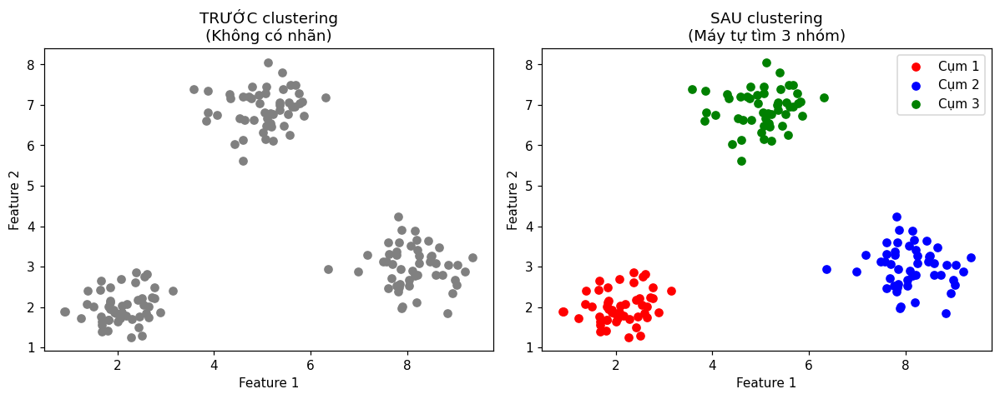

### 2.2.3 Ứng dụng thực tế

| Lĩnh vực | Ứng dụng | Mục đích |
|----|----|----|
| **Marketing** | Phân khúc khách hàng | Chiến lược marketing riêng cho từng nhóm |
| **E-commerce** | Gợi ý sản phẩm | Tăng doanh thu, cross-sell |
| **Y tế** | Phân nhóm bệnh nhân | Điều trị cá nhân hóa |
| **Sinh học** | Phân loại gen | Nghiên cứu di truyền |
| **Xử lý ảnh** | Phân đoạn ảnh | Computer Vision, object detection |
| **Mạng xã hội** | Phát hiện cộng đồng | Phân tích mạng lưới |
| **Tài chính** | Phát hiện gian lận | Nhóm giao dịch bất thường |

**Ví dụ cụ thể: Phân khúc khách hàng**

```python
rng = np.random.default_rng(42)

# Tạo dữ liệu khách hàng
customers = pd.DataFrame({
    "Age": np.concatenate([rng.normal(25, 4, 70), rng.normal(45, 5, 60), rng.normal(65, 6, 70)]),
    "Income": np.concatenate([rng.normal(30, 8, 70), rng.normal(70, 10, 60), rng.normal(45, 8, 70)]),
    "Spending": np.concatenate([rng.normal(20, 5, 70), rng.normal(80, 12, 60), rng.normal(40, 8, 70)]),
})

# K-Means (R: kmeans(customers, centers = 3, nstart = 25))
km = KMeans(n_clusters=3, n_init=25, random_state=42).fit(customers)
customers["Cluster"] = sap_xep_cum(km.labels_, customers["Age"])   # Cụm 1 = trẻ nhất
centers = customers.groupby("Cluster")[["Age", "Income", "Spending"]].mean()

# Visualization
fig, axes = plt.subplots(1, 2, figsize=(11, 4.5))
cols = COLORS[customers["Cluster"] - 1]

axes[0].scatter(customers["Age"], customers["Income"], c=cols)
axes[0].scatter(centers["Age"], centers["Income"], marker="x", s=200, linewidths=3, color="black")
axes[0].set(xlabel="Tuổi", ylabel="Thu nhập (triệu/tháng)", title="Age vs Income")

axes[1].scatter(customers["Income"], customers["Spending"], c=cols)
axes[1].scatter(centers["Income"], centers["Spending"], marker="x", s=200, linewidths=3, color="black")
axes[1].set(xlabel="Thu nhập", ylabel="Chi tiêu", title="Income vs Spending")
plt.tight_layout()
plt.show()
```

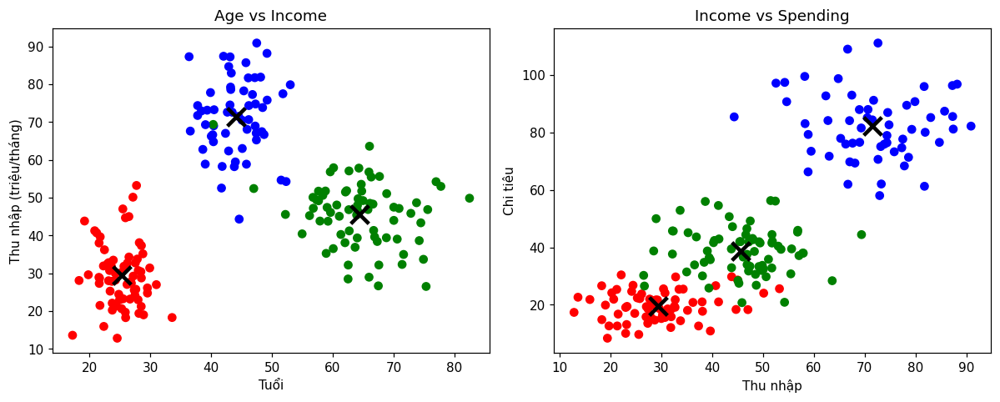

**Phân tích 3 nhóm khách hàng:**

```python
# Thống kê từng cụm (R: tapply)
cluster_summary = customers.groupby("Cluster").agg(
    So_luong=("Age", "size"),
    Tuoi_TB=("Age", "mean"),
    Thu_nhap_TB=("Income", "mean"),
    Chi_tieu_TB=("Spending", "mean"),
).round(1)

cluster_summary
```

```text
         So_luong  Tuoi_TB  Thu_nhap_TB  Chi_tieu_TB
Cluster                                             
1              70     25.2         29.4         19.6
2              58     44.1         71.5         82.2
3              72     64.5         45.7         38.7
```

**Đặc điểm và chiến lược:**

- **Cụm 1**: Trẻ, thu nhập thấp, chi tiêu thấp
  - Chiến lược: Sản phẩm giá rẻ, khuyến mãi mạnh
- **Cụm 2**: Trung niên, thu nhập cao, chi tiêu cao
  - Chiến lược: Sản phẩm cao cấp, chương trình VIP
- **Cụm 3**: Cao tuổi, thu nhập trung bình, chi tiêu vừa phải
  - Chiến lược: Sản phẩm chất lượng, dịch vụ tốt

------------------------------------------------------------------------

## 2.3 K-Means Clustering

### 2.3.1 Hiểu thuật toán K-Means từ đầu

**K-Means là gì?**

K-Means là thuật toán phân cụm dựa trên **khoảng cách**. Mục tiêu là
chia N điểm dữ liệu thành K cụm, sao cho:

- Các điểm **trong cùng cụm** gần nhau nhất (homogeneous)
- Các điểm **khác cụm** xa nhau nhất (well-separated)

**Tên gọi:**

- **K**: Số cụm (phải chọn trước)
- **Means**: Trung bình (centroid là điểm trung bình)

### 2.3.2 Các bước thuật toán chi tiết

**Bước 0: Chuẩn bị**

- Input: Dữ liệu X với N điểm, số cụm K
- Output: Gán nhãn cụm cho mỗi điểm

**Bước 1: Khởi tạo (Initialization)**

Chọn K centroids (tâm cụm) ban đầu. Có 3 cách phổ biến:

1.  **Random** - Chọn ngẫu nhiên K điểm làm centroids
2.  **K-Means++** - Chọn thông minh để centroids xa nhau (mặc định của scikit-learn: `init="k-means++"`)
3.  **Random Partition** - Gán ngẫu nhiên, rồi tính centroids

```python
rng = np.random.default_rng(42)

# Tạo dữ liệu mẫu
data_points = pd.DataFrame({
    "x": np.concatenate([rng.normal(2, 0.5, 30), rng.normal(8, 0.6, 30), rng.normal(5, 0.5, 30)]),
    "y": np.concatenate([rng.normal(2, 0.5, 30), rng.normal(3, 0.6, 30), rng.normal(7, 0.5, 30)]),
})
P = data_points.to_numpy()   # Mảng NumPy (90 x 2) để tính toán

fig, axes = plt.subplots(1, 3, figsize=(15, 4.5))

def ve_centroid(ax, C, color, title):
    ax.scatter(P[:, 0], P[:, 1], color="gray")
    ax.scatter(C[:, 0], C[:, 1], marker="*", s=400, color=color, edgecolors="black")
    for i, (cx, cy) in enumerate(C):
        ax.text(cx, cy + 0.5, f"C{i + 1}", color=color, fontweight="bold", ha="center")
    ax.set(title=title, xlabel="X", ylabel="Y")

# Cách 1: Random
rng1 = np.random.default_rng(123)
random_idx = rng1.choice(len(P), 3, replace=False)
ve_centroid(axes[0], P[random_idx], "red", "Cách 1: Random\nChọn ngẫu nhiên 3 điểm")

# Cách 2: K-Means++ (mô phỏng - chọn xa nhau)
c1_idx = rng1.integers(len(P))
dist_to_c1 = np.linalg.norm(P - P[c1_idx], axis=1)
c2_idx = np.argmax(dist_to_c1)
dist_to_c2 = np.linalg.norm(P - P[c2_idx], axis=1)
c3_idx = np.argmax(np.minimum(dist_to_c1, dist_to_c2))
kmpp_idx = [c1_idx, c2_idx, c3_idx]
ve_centroid(axes[1], P[kmpp_idx], "blue", "Cách 2: K-Means++\nChọn thông minh (xa nhau)")

# Cách 3: Random Partition
rng3 = np.random.default_rng(456)
random_clusters = rng3.integers(0, 3, len(P))
centers_rp = np.array([P[random_clusters == k].mean(axis=0) for k in range(3)])
ve_centroid(axes[2], centers_rp, "green", "Cách 3: Random Partition\nGán ngẫu nhiên → Tính centroid")

plt.tight_layout()
plt.show()
```

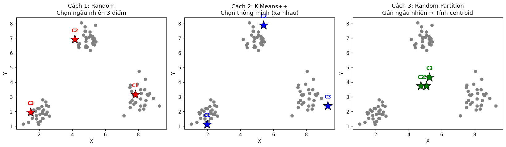

**Bước 2: Assignment (Gán cụm)**

Với mỗi điểm, tính khoảng cách đến **tất cả K centroids**, gán vào cụm
**gần nhất**.

**Công thức khoảng cách Euclidean:**

``` math
d(x, c) = \sqrt{(x_1 - c_1)^2 + (x_2 - c_2)^2 + ... + (x_n - c_n)^2}
```

**Ví dụ tính khoảng cách:**

```python
# Giả sử có 1 điểm và 3 centroids
point = np.array([5, 5])
centroids = np.array([[2, 2],    # C1
                      [8, 3],    # C2
                      [5, 7]])   # C3

# Tính khoảng cách (np.linalg.norm = căn tổng bình phương)
d = np.linalg.norm(centroids - point, axis=1)

# Kết quả
pd.DataFrame({
    "Centroid": ["C1", "C2", "C3"],
    "Toa_do": ["(2, 2)", "(8, 3)", "(5, 7)"],
    "Khoang_cach": d.round(2),
    "Gan_cum": np.where(d == d.min(), "✓", ""),
})
```

```text
  Centroid  Toa_do  Khoang_cach Gan_cum
0       C1  (2, 2)         4.24        
1       C2  (8, 3)         3.61        
2       C3  (5, 7)         2.00       ✓
```

**Giải thích:** Điểm (5, 5) gần C3 nhất → Gán vào Cụm 3

**Minh họa Assignment:**

Để thấy rõ từng bước, ta tự viết 2 hàm cho **Bước 2 (assign)** và **Bước 3 (update)** – đây chính là thuật toán Lloyd mà `KMeans` thực hiện bên trong:

```python
def assign(P, C):
    """Bước 2: gán mỗi điểm vào centroid gần nhất."""
    return cdist(P, C).argmin(axis=1)

def update(P, labels, K):
    """Bước 3: centroid mới = trung bình các điểm trong cụm."""
    return np.array([P[labels == k].mean(axis=0) for k in range(K)])

C0 = P[kmpp_idx]                  # Centroids ban đầu (K-Means++)
labels0 = assign(P, C0)

fig, axes = plt.subplots(1, 2, figsize=(11, 4.5))

# Trước assignment
axes[0].scatter(P[:, 0], P[:, 1], color="gray")
axes[0].scatter(C0[:, 0], C0[:, 1], marker="*", s=400, color="black")
axes[0].set(title="TRƯỚC Assignment\nCác điểm chưa có nhãn", xlabel="X", ylabel="Y")

# Sau assignment
axes[1].scatter(P[:, 0], P[:, 1], c=COLORS[labels0])
axes[1].scatter(C0[:, 0], C0[:, 1], marker="*", s=400, color="black")
axes[1].set(title="SAU Assignment\nMỗi điểm gán vào cụm gần nhất", xlabel="X", ylabel="Y")
plt.tight_layout()
plt.show()
```

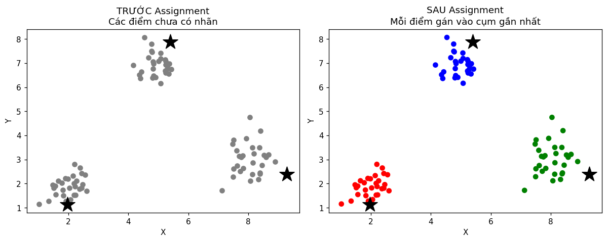

**Bước 3: Update (Cập nhật centroids)**

Với mỗi cụm, tính **centroid mới** = trung bình tọa độ của tất cả điểm
trong cụm.

**Công thức:**

``` math
\mu_k = \frac{1}{|C_k|} \sum_{x \in C_k} x
```

Trong đó $`|C_k|`$ là số điểm trong cụm k.

**Ví dụ tính centroid:**

```python
# Giả sử Cụm 1 có 3 điểm
cluster1_points = pd.DataFrame({"x": [2.1, 2.5, 1.8],
                                "y": [2.3, 1.9, 2.1]})
cluster1_points
```

```text
     x    y
0  2.1  2.3
1  2.5  1.9
2  1.8  2.1
```

```python
# Tính centroid mới (R: colMeans)
new_centroid = cluster1_points.mean()

pd.DataFrame({
    "Thanh_phan": ["μ_x", "μ_y"],
    "Cong_thuc": ["(2.1 + 2.5 + 1.8) / 3", "(2.3 + 1.9 + 2.1) / 3"],
    "Ket_qua": new_centroid.round(2).values,
})
```

```text
  Thanh_phan              Cong_thuc  Ket_qua
0        μ_x  (2.1 + 2.5 + 1.8) / 3     2.13
1        μ_y  (2.3 + 1.9 + 2.1) / 3     2.10
```

**Minh họa Update:**

```python
C1 = update(P, labels0, 3)        # Centroids mới sau khi cập nhật
labels1 = assign(P, C1)

fig, axes = plt.subplots(1, 2, figsize=(11, 4.5))

# Trước update (centroids cũ)
axes[0].scatter(P[:, 0], P[:, 1], c=COLORS[labels0])
axes[0].scatter(C0[:, 0], C0[:, 1], marker="*", s=400, color="black")
axes[0].set(title="TRƯỚC Update\nCentroids ở vị trí cũ", xlabel="X", ylabel="Y")

# Sau update (centroids mới)
axes[1].scatter(P[:, 0], P[:, 1], c=COLORS[labels1])
axes[1].scatter(C1[:, 0], C1[:, 1], marker="x", s=250, linewidths=3, color="black")

# Vẽ mũi tên di chuyển
for (x0, y0), (x1, y1) in zip(C0, C1):
    axes[1].annotate("", xy=(x1, y1), xytext=(x0, y0),
                     arrowprops=dict(arrowstyle="->", color="purple", lw=2))
axes[1].set(title="SAU Update\nCentroids di chuyển về trung tâm", xlabel="X", ylabel="Y")
plt.tight_layout()
plt.show()
```

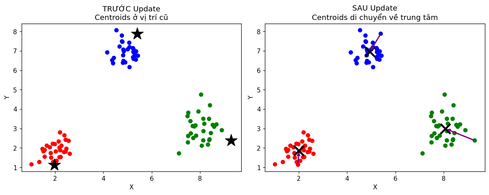

**Bước 4: Lặp lại**

Lặp lại Bước 2-3 cho đến khi:

- Centroids không đổi (hội tụ), HOẶC
- Đạt số iteration tối đa

### 2.3.3 Minh họa đầy đủ quá trình K-Means

Để thấy rõ quá trình hội tụ, ta cố ý khởi tạo bằng cách **Random** (dễ chọn phải các điểm gần nhau):

```python
rng = np.random.default_rng(7)
C = P[rng.choice(len(P), 3, replace=False)]    # Khởi tạo ngẫu nhiên

history = []
for it in range(6):
    labels = assign(P, C)                      # Bước 2
    wss = ((P - C[labels]) ** 2).sum()         # WSS với centroids hiện tại
    history.append((C.copy(), labels, wss))
    C = update(P, labels, 3)                   # Bước 3

# Vẽ 6 iterations
fig, axes = plt.subplots(3, 2, figsize=(10, 12))
for i, ax in enumerate(axes.flat):
    C_i, labels_i, wss_i = history[i]
    ax.scatter(P[:, 0], P[:, 1], c=COLORS[labels_i])
    ax.scatter(C_i[:, 0], C_i[:, 1], marker="x", s=200, linewidths=3, color="black")
    if i > 0:   # Vẽ mũi tên di chuyển (trừ iteration 1)
        for (x0, y0), (x1, y1) in zip(history[i - 1][0], C_i):
            ax.annotate("", xy=(x1, y1), xytext=(x0, y0),
                        arrowprops=dict(arrowstyle="->", color="purple", lw=1.5))
    ax.set(title=f"Iteration {i + 1}\nWSS = {wss_i:.1f}", xlabel="X", ylabel="Y")
plt.tight_layout()
plt.show()
```

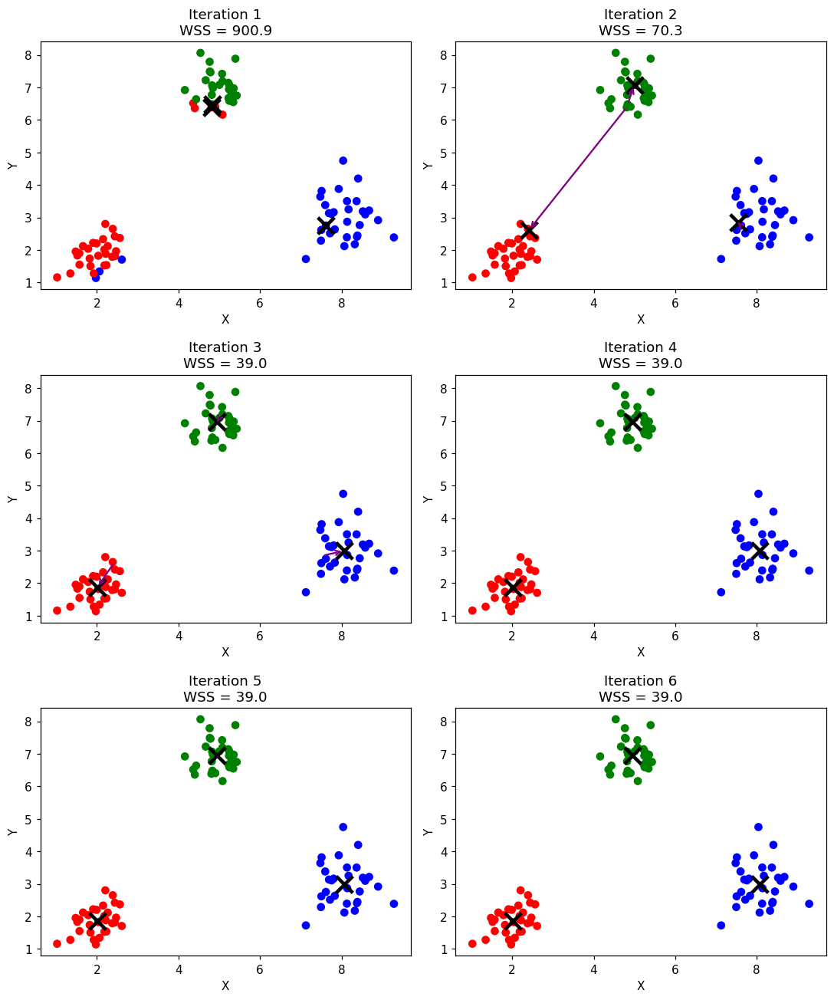

**Quá trình hội tụ:**

```python
pd.DataFrame({"Iteration": range(1, 7),
              "WSS": [round(h[2], 2) for h in history]})
```

```text
   Iteration     WSS
0          1  900.89
1          2   70.28
2          3   39.02
3          4   39.02
4          5   39.02
5          6   39.02
```

**Nhận xét:** WSS giảm dần và ổn định → Thuật toán hội tụ

### 2.3.4 Hàm mục tiêu của K-Means

**Mục tiêu:** Tối thiểu hóa tổng khoảng cách bình phương trong cụm (WSS)

``` math
J = \sum_{k=1}^{K} \sum_{x \in C_k} ||x - \mu_k||^2
```

Trong đó:

- K: Số cụm
- $`C_k`$: Cụm thứ k
- $`\mu_k`$: Centroid của cụm k
- $`||x - \mu_k||^2`$: Khoảng cách Euclidean bình phương

> Trong scikit-learn, giá trị J (WSS) được lưu ở thuộc tính **`inertia_`** (tương đương `tot.withinss` trong R).

**Minh họa hàm mục tiêu:**

```python
km_final = KMeans(n_clusters=3, n_init=25, random_state=42).fit(P)
lab = km_final.labels_
cen = km_final.cluster_centers_

plt.scatter(P[:, 0], P[:, 1], c=COLORS[lab])
plt.scatter(cen[:, 0], cen[:, 1], marker="x", s=250, linewidths=3, color="black")

# Vẽ khoảng cách từ 15 điểm ngẫu nhiên đến centroid của nó
rng = np.random.default_rng(789)
for i in rng.choice(len(P), 15, replace=False):
    k = lab[i]
    plt.plot([P[i, 0], cen[k, 0]], [P[i, 1], cen[k, 1]],
             color=COLORS[k], linestyle="--", linewidth=1.5)

plt.title("Hàm mục tiêu: Tối thiểu hóa khoảng cách")
plt.xlabel("X")
plt.ylabel("Y")
plt.show()
```

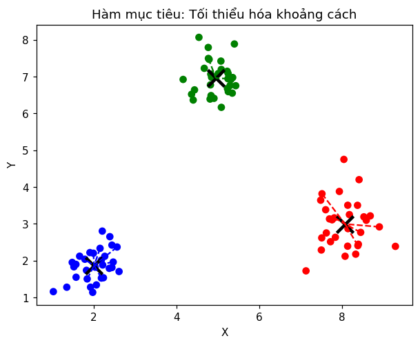

**Tính toán WSS từng cụm:**

```python
wss_by_cluster = [((P[lab == k] - cen[k]) ** 2).sum() for k in range(3)]

pd.DataFrame({
    "Cum": [1, 2, 3],
    "So_diem": np.bincount(lab),
    "WSS": np.round(wss_by_cluster, 2),
})
```

```text
   Cum  So_diem    WSS
0    1       30  19.63
1    2       30   9.59
2    3       30   9.80
```

**Tổng WSS:**

```python
print("Tổng WSS (tự tính):", round(sum(wss_by_cluster), 4))
print("km_final.inertia_ :", round(km_final.inertia_, 4))
```

```text
Tổng WSS (tự tính): 39.0241
km_final.inertia_ : 39.0241
```

### 2.3.5 Tại sao cần n_init = 25? (tương đương nstart trong R)

K-Means **nhạy cảm với khởi tạo**. Khởi tạo khác nhau → Kết quả khác
nhau!

Ở ví dụ dưới, ta dùng `init="random"` (khởi tạo ngẫu nhiên như R) và `n_init=1` (chỉ chạy 1 lần) với dữ liệu có **5 nhóm** nhưng yêu cầu K = 5:

```python
rng = np.random.default_rng(1)
centers5 = np.array([[2, 2], [2, 8], [8, 2], [8, 8], [5, 5]])
P5 = np.vstack([rng.normal(c, 0.6, size=(30, 2)) for c in centers5])

fig, axes = plt.subplots(2, 3, figsize=(15, 9))
wss_results = []

# Chạy 6 lần với seed khác nhau
for i, ax in enumerate(axes.flat):
    km_temp = KMeans(n_clusters=5, init="random", n_init=1, random_state=i * 100).fit(P5)
    wss_results.append(km_temp.inertia_)
    ax.scatter(P5[:, 0], P5[:, 1], c=COLORS[km_temp.labels_])
    ax.scatter(*km_temp.cluster_centers_.T, marker="x", s=200, linewidths=3, color="black")
    ax.set(title=f"Lần {i + 1} - WSS = {km_temp.inertia_:.0f}", xlabel="X", ylabel="Y")

plt.tight_layout()
plt.show()
```

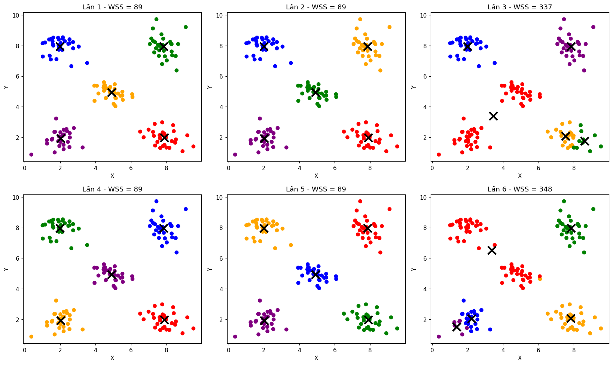

**So sánh kết quả:**

```python
# n_init = 1 (chạy 1 lần)
km_n1 = KMeans(n_clusters=5, init="random", n_init=1, random_state=200).fit(P5)   # giống "Lần 3" ở trên

# n_init = 25 (chạy 25 lần, chọn tốt nhất)
km_n25 = KMeans(n_clusters=5, init="random", n_init=25, random_state=100).fit(P5)

pd.DataFrame({
    "Phuong_phap": ["n_init = 1", "n_init = 25"],
    "WSS": [round(km_n1.inertia_, 2), round(km_n25.inertia_, 2)],
    "Ghi_chu": ["Có thể bị local minimum", "Chọn kết quả tốt nhất"],
})
```

```text
   Phuong_phap     WSS                  Ghi_chu
0   n_init = 1  336.87  Có thể bị local minimum
1  n_init = 25   88.99    Chọn kết quả tốt nhất
```

**Kết luận:**

- `n_init=1`: Chạy 1 lần → Có thể kém (rơi vào *local minimum*)
- `n_init=25`: Chạy 25 lần → Chọn WSS nhỏ nhất
- **Nên dùng `n_init=25` hoặc cao hơn**, kèm `random_state` cố định để tái lập kết quả

### 2.3.6 Ví dụ thực tế: Phân khúc khách hàng

```python
rng = np.random.default_rng(42)

# Dữ liệu khách hàng
customers = pd.DataFrame({
    "CustomerID": np.arange(1, 201),
    "Age": np.concatenate([rng.normal(25, 4, 70), rng.normal(45, 5, 60), rng.normal(65, 6, 70)]),
    "Income": np.concatenate([rng.normal(30, 8, 70), rng.normal(70, 10, 60), rng.normal(45, 8, 70)]),
    "Spending": np.concatenate([rng.normal(20, 5, 70), rng.normal(80, 12, 60), rng.normal(40, 8, 70)]),
})

# Xem dữ liệu mẫu
customers.head()
```

```text
   CustomerID        Age     Income   Spending
0           1  26.218868  32.700596  19.101943
1           2  20.840064  41.259855  20.983880
2           3  28.001805  30.724679  24.102642
3           4  28.762259  35.151510  18.031294
4           5  17.195859  13.598623  22.605836
```

**Thống kê mô tả:**

```python
customers[["Age", "Income", "Spending"]].describe().round(2)
```

```text
          Age  Income  Spending
count  200.00  200.00    200.00
mean    44.83   47.48     44.65
std     17.33   19.04     26.69
min     17.20   12.82      8.33
25%     27.43   31.72     21.89
50%     43.89   45.98     37.32
75%     61.14   62.47     70.00
max     82.48   90.93    111.17
```

**K-Means clustering:**

```python
X_cus = customers[["Age", "Income", "Spending"]]

# K-Means với K = 3
km_customers = KMeans(n_clusters=3, n_init=25, random_state=42).fit(X_cus)
customers["Cluster"] = sap_xep_cum(km_customers.labels_, customers["Age"])

# Kích thước các cụm
customers["Cluster"].value_counts().sort_index()
```

```text
Cluster
1    70
2    58
3    72
```

```python
# Centroids (theo thứ tự cụm đã đánh số lại)
centers = customers.groupby("Cluster")[["Age", "Income", "Spending"]].mean()
centers.round(2)
```

```text
           Age  Income  Spending
Cluster                         
1        25.23   29.42     19.62
2        44.13   71.51     82.17
3        64.45   45.68     38.74
```

**Visualization:**

```python
cols = COLORS[customers["Cluster"] - 1]
fig, axes = plt.subplots(2, 2, figsize=(11, 9))

# Age vs Income
for k in range(1, 4):
    m = customers["Cluster"] == k
    axes[0, 0].scatter(customers.loc[m, "Age"], customers.loc[m, "Income"],
                       color=COLORS[k - 1], label=f"Cụm {k}")
axes[0, 0].scatter(centers["Age"], centers["Income"], marker="x", s=200, linewidths=3, color="black")
axes[0, 0].set(xlabel="Tuổi", ylabel="Thu nhập (triệu/tháng)", title="Age vs Income")
axes[0, 0].legend(loc="upper right")

# Age vs Spending
axes[0, 1].scatter(customers["Age"], customers["Spending"], c=cols)
axes[0, 1].set(xlabel="Tuổi", ylabel="Chi tiêu (triệu/tháng)", title="Age vs Spending")

# Income vs Spending
axes[1, 0].scatter(customers["Income"], customers["Spending"], c=cols)
axes[1, 0].scatter(centers["Income"], centers["Spending"], marker="x", s=200, linewidths=3, color="black")
axes[1, 0].set(xlabel="Thu nhập", ylabel="Chi tiêu", title="Income vs Spending")

# Cluster sizes
sizes = customers["Cluster"].value_counts().sort_index()
axes[1, 1].bar([f"Cụm {k}" for k in sizes.index], sizes.values, color=COLORS[:3])
axes[1, 1].set(title="Kích thước các cụm", ylabel="Số khách hàng")

plt.tight_layout()
plt.show()
```

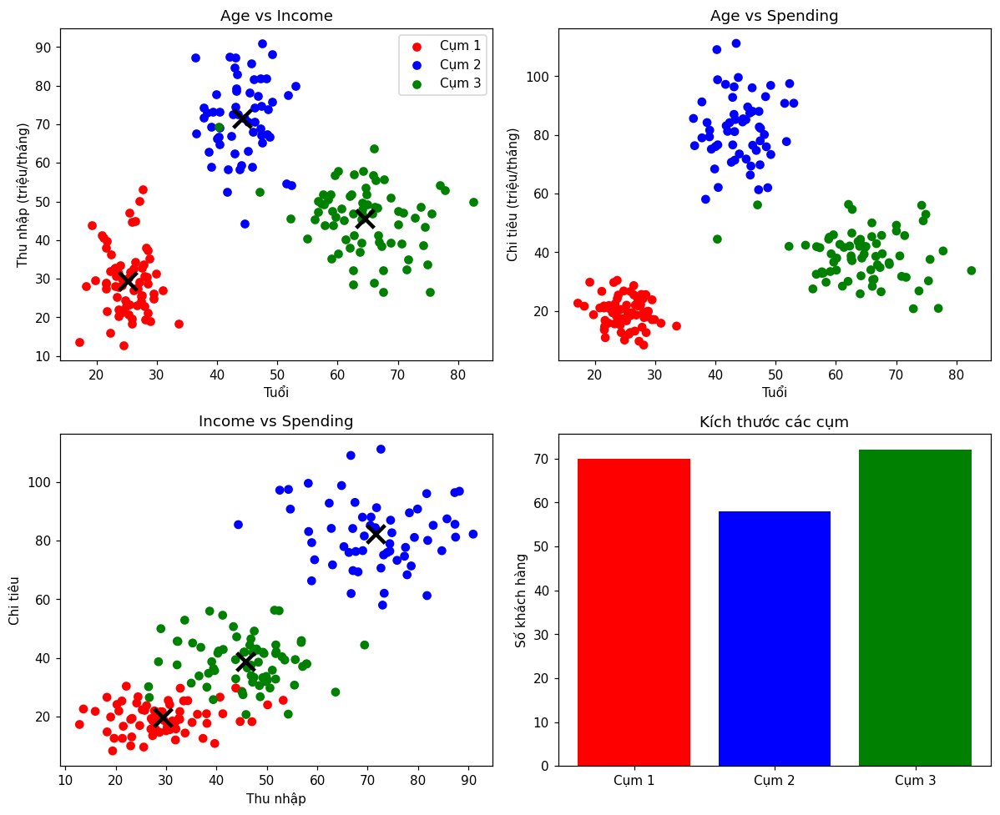

**Phân tích từng cụm:**

```python
cluster_summary = customers.groupby("Cluster").agg(
    So_luong=("Age", "size"),
    Tuoi_TB=("Age", "mean"),
    Thu_nhap_TB=("Income", "mean"),
    Chi_tieu_TB=("Spending", "mean"),
).round(1)

cluster_summary
```

```text
         So_luong  Tuoi_TB  Thu_nhap_TB  Chi_tieu_TB
Cluster                                             
1              70     25.2         29.4         19.6
2              58     44.1         71.5         82.2
3              72     64.5         45.7         38.7
```

**Đặc điểm và chiến lược marketing:**

- **Cụm 1**: Trẻ (≈25 tuổi), thu nhập thấp, chi tiêu thấp
  - Chiến lược: Sản phẩm giá rẻ, khuyến mãi mạnh, marketing qua mạng xã
    hội
- **Cụm 2**: Trung niên (≈45 tuổi), thu nhập cao, chi tiêu cao
  - Chiến lược: Sản phẩm cao cấp, chương trình VIP, dịch vụ cá nhân hóa
- **Cụm 3**: Cao tuổi (≈65 tuổi), thu nhập trung bình, chi tiêu vừa phải
  - Chiến lược: Sản phẩm chất lượng bền vững, dịch vụ chu đáo

> **Lưu ý:** Trong ví dụ này, các biến có thang đo tương đương nhau (tuổi, triệu đồng) nên ta phân cụm trực tiếp. Khi các biến có đơn vị rất khác nhau (ví dụ tuổi và thu nhập tính bằng đồng), **phải chuẩn hóa** (`StandardScaler`) trước khi chạy K-Means, vì K-Means dựa trên khoảng cách.

------------------------------------------------------------------------

## 2.4 Chọn số cụm K tối ưu

### 2.4.1 Vấn đề chọn K

**Câu hỏi lớn nhất trong K-Means**: Chọn K = bao nhiêu?

K-Means **BẮT BUỘC** phải biết K trước khi chạy. Trong thực tế:

- Không biết dữ liệu có bao nhiêu nhóm tự nhiên
- Không có “đáp án đúng” (dữ liệu không có nhãn)
- K khác nhau → Kết quả hoàn toàn khác

**Minh họa: Cùng dữ liệu, khác K**

```python
rng = np.random.default_rng(42)

# Dữ liệu khách hàng (2 biến)
customers2 = pd.DataFrame({
    "Age": np.concatenate([rng.normal(25, 4, 70), rng.normal(45, 5, 60), rng.normal(65, 6, 70)]),
    "Income": np.concatenate([rng.normal(30, 8, 70), rng.normal(70, 10, 60), rng.normal(45, 8, 70)]),
})
X2 = customers2.to_numpy()

fig, axes = plt.subplots(2, 3, figsize=(15, 9))
for ax, k in zip(axes.flat, range(2, 8)):
    km = KMeans(n_clusters=k, n_init=25, random_state=42).fit(X2)
    ax.scatter(X2[:, 0], X2[:, 1], c=km.labels_, cmap="rainbow")
    ax.scatter(*km.cluster_centers_.T, marker="x", s=150, linewidths=2.5, color="black")
    ax.set(xlabel="Tuổi", ylabel="Thu nhập", title=f"K = {k}")
plt.tight_layout()
plt.show()
```

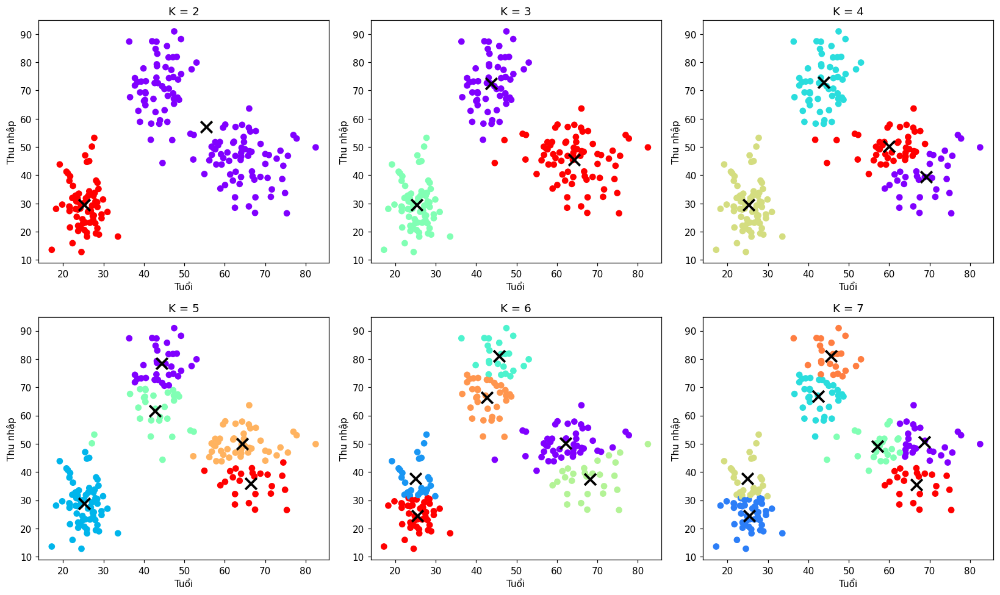

**Nhận xét:**

- **K = 2**: Quá đơn giản, mất thông tin
- **K = 3**: Vừa phải, dễ hiểu
- **K = 7**: Quá phức tạp, khó giải thích

→ Cần phương pháp khoa học!

**Hậu quả chọn sai K:**

```python
fig, axes = plt.subplots(1, 3, figsize=(15, 4.5))
titles = {2: "K=2: UNDERFITTING\nCụm không đồng nhất",
          3: "K=3: GOOD FIT\nCụm rõ ràng",
          7: "K=7: OVERFITTING\nQuá phức tạp"}

for ax, (k, title) in zip(axes, titles.items()):
    km = KMeans(n_clusters=k, n_init=25, random_state=42).fit(X2)
    ax.scatter(X2[:, 0], X2[:, 1], c=km.labels_, cmap="rainbow")
    ax.scatter(*km.cluster_centers_.T, marker="x", s=200, linewidths=3, color="black")
    ax.set(title=title, xlabel="Tuổi", ylabel="Thu nhập")
plt.tight_layout()
plt.show()
```

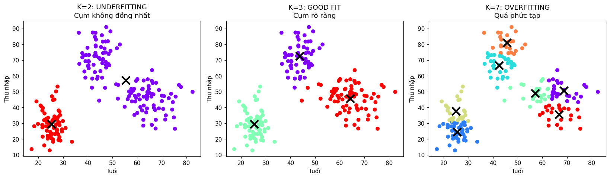

### 2.4.2 Elbow Method

**Ý tưởng:** Vẽ WSS theo K, tìm điểm “khuỷu tay”.

**WSS (Within-cluster Sum of Squares):**

``` math
WSS = \sum_{k=1}^{K} \sum_{x \in C_k} ||x - \mu_k||^2
```

- Tổng khoảng cách bình phương từ điểm đến centroid
- WSS giảm khi K tăng
- Tìm điểm WSS giảm chậm lại

**Ví dụ tính WSS:**

```python
# Dữ liệu nhỏ
small_data = pd.DataFrame({"x": [1, 2, 2, 8, 9, 9],
                           "y": [1, 1, 2, 8, 8, 9]})
small_data
```

```text
   x  y
0  1  1
1  2  1
2  2  2
3  8  8
4  9  8
5  9  9
```

```python
# K = 2
km_small = KMeans(n_clusters=2, n_init=25, random_state=42).fit(small_data)

print("Clusters :", km_small.labels_)            # Nhãn cụm (bắt đầu từ 0)
print("Centroids:\n", km_small.cluster_centers_)
print("WSS      :", km_small.inertia_)
```

```text
Clusters : [0 0 0 1 1 1]
Centroids:
 [[1.66666667 1.33333333]
 [8.66666667 8.33333333]]
WSS      : 2.666666666666667
```

**Giải thích:** Điểm 1,2,3 (gần nhau) thuộc một cụm, điểm 4,5,6 (gần nhau) thuộc cụm còn lại → WSS thấp

**Triển khai Elbow Method:**

```python
# Tính WSS cho K = 1 đến 10
K_range = range(1, 11)
wss_values = np.array([KMeans(n_clusters=k, n_init=25, random_state=42).fit(X2).inertia_
                       for k in K_range])

# Vẽ biểu đồ
plt.plot(K_range, wss_values, marker="o", color="blue", linewidth=2)
plt.grid(linestyle=":")

# Đánh dấu elbow
plt.scatter(3, wss_values[2], color="red", s=300, zorder=3)
plt.annotate("Elbow\nK = 3", xy=(3, wss_values[2]), xytext=(4, wss_values[2] + 20000),
             color="red", fontweight="bold", arrowprops=dict(arrowstyle="->", color="red"))

# Giá trị WSS
for k, w in zip(K_range, wss_values):
    plt.text(k, w + 3000, f"{w:.0f}", fontsize=8, color="darkblue", ha="center")

plt.xlabel("Số cụm K")
plt.ylabel("WSS")
plt.title("Elbow Method")
plt.show()
```

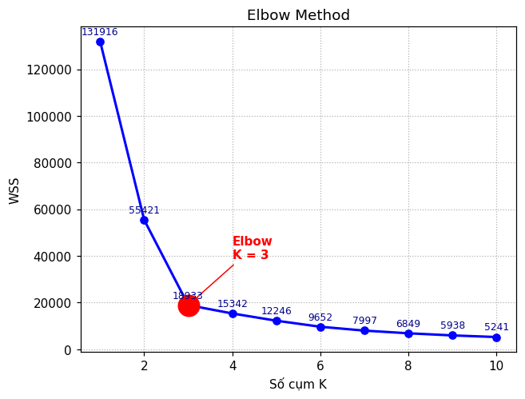

**Bảng phân tích:**

```python
giam = -np.diff(wss_values)
pd.DataFrame({
    "K": K_range,
    "WSS": wss_values.round(0),
    "Giam": np.concatenate([[np.nan], giam.round(0)]),
    "Giam_pct": np.concatenate([[np.nan], (giam / wss_values[:-1] * 100).round(1)]),
})
```

```text
    K       WSS     Giam  Giam_pct
0   1  131916.0      NaN       NaN
1   2   55421.0  76495.0      58.0
2   3   18933.0  36488.0      65.8
3   4   15342.0   3591.0      19.0
4   5   12246.0   3096.0      20.2
5   6    9652.0   2594.0      21.2
6   7    7997.0   1655.0      17.1
7   8    6849.0   1148.0      14.4
8   9    5938.0    911.0      13.3
9  10    5241.0    698.0      11.7
```

**Nhận xét:**

- K=1→2: WSS giảm mạnh
- K=2→3: WSS giảm mạnh  
- K=3→4: WSS giảm chậm lại ← **ELBOW**
- K\>3: WSS giảm ít

→ **Chọn K = 3**

**Giải thích Elbow:**

```python
fig, axes = plt.subplots(1, 2, figsize=(11, 4.5))

# WSS
axes[0].plot(K_range, wss_values, marker="o", color="blue", linewidth=2)
axes[0].scatter(3, wss_values[2], color="red", s=250, zorder=3)
axes[0].set(xlabel="K", ylabel="WSS", title="Tại sao gọi là 'Elbow'?")

# % giảm
pct_decrease = giam / wss_values[:-1] * 100
axes[1].plot(range(2, 11), pct_decrease, marker="o", color="darkgreen", linewidth=2)
axes[1].axhline(10, color="red", linestyle="--")
axes[1].set(xlabel="K", ylabel="% Giảm WSS", title="Tốc độ giảm WSS")
plt.tight_layout()
plt.show()
```

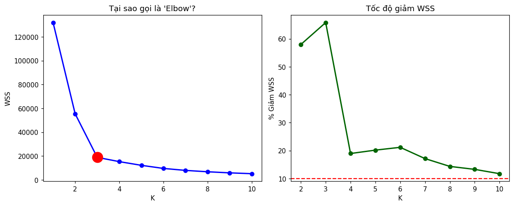

**Cách nhận biết Elbow:**

- **Trước elbow**: WSS giảm nhanh → Mỗi cụm mang lại giá trị lớn
- **Sau elbow**: WSS giảm chậm → Thêm cụm không mang lại nhiều giá trị

→ K tại elbow = cân bằng độ chính xác và độ đơn giản

**Hạn chế:**

```python
# Dữ liệu khó xác định elbow (một đám mây điểm, không có nhóm tự nhiên)
rng = np.random.default_rng(123)
difficult = rng.normal(5, 3, size=(200, 2))
wss_diff = [KMeans(n_clusters=k, n_init=25, random_state=42).fit(difficult).inertia_
            for k in K_range]

fig, axes = plt.subplots(1, 2, figsize=(11, 4.5))
axes[0].plot(K_range, wss_values, marker="o", color="blue", linewidth=2)
axes[0].scatter(3, wss_values[2], color="red", s=200, zorder=3)
axes[0].set(title="Elbow RÕ RÀNG", xlabel="K", ylabel="WSS")

axes[1].plot(K_range, wss_diff, marker="o", color="blue", linewidth=2)
axes[1].set(title="Elbow KHÔNG RÕ", xlabel="K", ylabel="WSS")
plt.tight_layout()
plt.show()
```

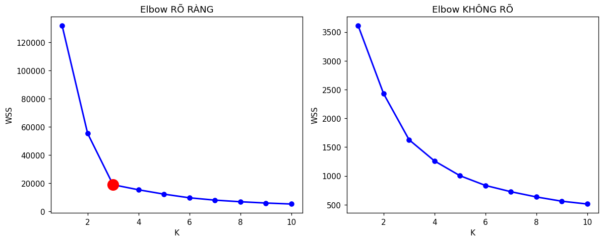

**Kết luận Elbow Method:**

- ✅ Đơn giản, trực quan
- ❌ Elbow không phải lúc nào cũng rõ
- ❌ Phụ thuộc cảm nhận chủ quan

### 2.4.3 Silhouette Method

**Ý tưởng:** Đo độ phù hợp của mỗi điểm với cụm của nó.

**Silhouette Score s(i):**

``` math
s(i) = \frac{b(i) - a(i)}{\max(a(i), b(i))}
```

- **a(i)**: KC trung bình đến các điểm trong cùng cụm (càng nhỏ càng
  tốt)
- **b(i)**: KC trung bình đến cụm gần nhất khác (càng lớn càng tốt)

**Ví dụ minh họa:**

```python
# Dữ liệu đơn giản
example = np.array([[2, 2], [2.5, 2.3], [2.2, 1.8],
                    [8, 8], [8.5, 8.2], [8.3, 7.9]])
ex_clusters = np.array([0, 0, 0, 1, 1, 1])

plt.figure(figsize=(6, 6))
plt.scatter(example[:, 0], example[:, 1], c=COLORS[ex_clusters], s=250)

# Điểm i
i = 0
plt.scatter(*example[i], s=700, facecolors="none", edgecolors="black", linewidths=3)
plt.text(example[i, 0], example[i, 1] - 0.8, "i", fontweight="bold", fontsize=14, ha="center")

# KC đến cùng cụm (a)
for j in np.where((ex_clusters == 0) & (np.arange(6) != i))[0]:
    plt.plot(*zip(example[i], example[j]), color="red", linewidth=2)

# KC đến cụm khác (b)
for j in np.where(ex_clusters == 1)[0]:
    plt.plot(*zip(example[i], example[j]), color="blue", linewidth=2, linestyle="--")

plt.text(2.5, 3, "a(i)", color="red", fontweight="bold")
plt.text(5, 5, "b(i)", color="blue", fontweight="bold")
plt.xlim(0, 10)
plt.ylim(0, 10)
plt.title("Tính Silhouette cho điểm i")
plt.xlabel("X")
plt.ylabel("Y")
plt.show()
```

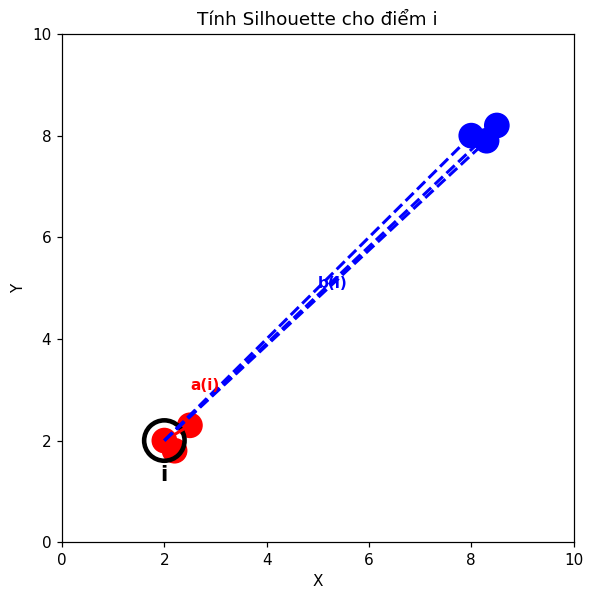

**Tính toán:**

```python
i = 0
same = np.where((ex_clusters == 0) & (np.arange(6) != i))[0]
other = np.where(ex_clusters == 1)[0]

a_i = np.linalg.norm(example[same] - example[i], axis=1).mean()
b_i = np.linalg.norm(example[other] - example[i], axis=1).mean()
s_i = (b_i - a_i) / max(a_i, b_i)

print(f"a(i) = {a_i:.2f}, b(i) = {b_i:.2f}, s(i) = {s_i:.3f}")
print("Kiểm tra bằng sklearn:", round(silhouette_samples(example, ex_clusters)[i], 3))
```

```text
a(i) = 0.43, b(i) = 8.70, s(i) = 0.950
Kiểm tra bằng sklearn: 0.95
```

**Ý nghĩa giá trị:**

| Giá trị            | Ý nghĩa           |
|--------------------|-------------------|
| s(i) \> 0.7        | Rất phù hợp       |
| 0.5 \< s(i) ≤ 0.7  | Phù hợp           |
| 0.25 \< s(i) ≤ 0.5 | Trung bình        |
| s(i) \< 0.25       | Có thể bị gán sai |

**Triển khai:**

```python
# Tính Silhouette trung bình cho K = 2 đến 10 (R: mean(silhouette(...)[, 3]))
K_sil = range(2, 11)
sil_scores = np.array([
    silhouette_score(X2, KMeans(n_clusters=k, n_init=25, random_state=42).fit_predict(X2))
    for k in K_sil
])

plt.plot(K_sil, sil_scores, marker="o", color="blue", linewidth=2)
plt.grid(linestyle=":")

# Best K
best_k = K_sil[np.argmax(sil_scores)]
plt.scatter(best_k, sil_scores.max(), color="red", s=300, zorder=3)
plt.text(best_k, sil_scores.max() + 0.04, f"Best K = {best_k}",
         color="red", fontweight="bold", ha="center")

# Ngưỡng
for h, c, txt in [(0.7, "darkgreen", ">0.7: Rất tốt"), (0.5, "orange", "0.5-0.7: Tốt"),
                  (0.3, "red", "0.3-0.5: TB")]:
    plt.axhline(h, color=c, linestyle="--")
    plt.text(9, h + 0.02, txt, color=c, fontsize=9)

plt.ylim(0, max(sil_scores.max() + 0.15, 0.8))
plt.xlabel("K")
plt.ylabel("Silhouette Score")
plt.title("Silhouette Method")
plt.show()
```

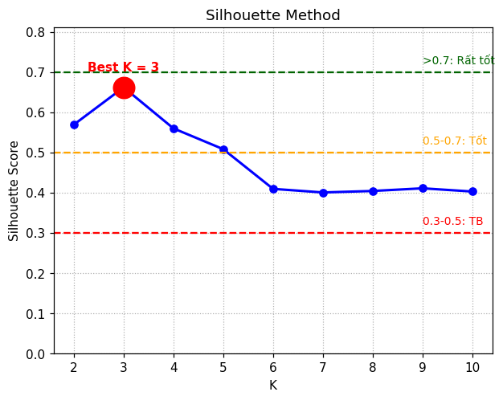

**Bảng kết quả:**

```python
pd.DataFrame({
    "K": K_sil,
    "Silhouette": sil_scores.round(4),
    "Danh_gia": np.select([sil_scores > 0.7, sil_scores > 0.5],
                          ["Rất tốt", "Tốt"], default="Trung bình"),
})
```

```text
    K  Silhouette    Danh_gia
0   2      0.5690         Tốt
1   3      0.6617         Tốt
2   4      0.5597         Tốt
3   5      0.5081         Tốt
4   6      0.4094  Trung bình
5   7      0.4005  Trung bình
6   8      0.4042  Trung bình
7   9      0.4108  Trung bình
8  10      0.4028  Trung bình
```

**Silhouette Plot chi tiết cho K=3:**

scikit-learn không có sẵn hàm vẽ Silhouette Plot như `plot(silhouette(...))` của R, nên ta tự viết một hàm nhỏ và dùng lại ở phần sau:

```python
def plot_silhouette(X, labels, ax=None, title=""):
    """Vẽ Silhouette Plot: mỗi thanh ngang là s(i) của một điểm, nhóm theo cụm."""
    ax = ax or plt.gca()
    s = silhouette_samples(X, labels)
    y_lower = 0
    for k_idx, k in enumerate(np.unique(labels)):
        s_k = np.sort(s[labels == k])
        ax.barh(np.arange(y_lower, y_lower + len(s_k)), s_k, height=1.0,
                color=COLORS[k_idx % len(COLORS)], edgecolor="none")
        ax.text(-0.08, y_lower + len(s_k) / 2, str(k))
        y_lower += len(s_k) + 5
    ax.axvline(s.mean(), color="black", linestyle="--")
    ax.set(xlabel="Silhouette s(i)", yticks=[], xlim=(-0.1, 1),
           title=f"{title}Avg = {s.mean():.3f}")

km3 = KMeans(n_clusters=3, n_init=25, random_state=42).fit(X2)
labels3 = sap_xep_cum(km3.labels_, X2[:, 0])

plt.figure(figsize=(7, 5))
plot_silhouette(X2, labels3, title="Silhouette Plot (K=3)\n")
plt.show()
```

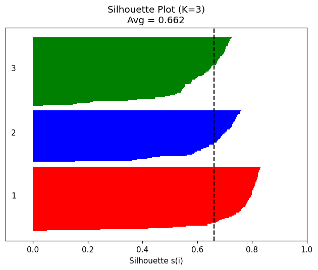

**Giải thích Silhouette Plot:**

- Chiều rộng: Silhouette score của từng điểm
- Đường đứt: Average score
- Cụm tốt: Hầu hết điểm \> average

### 2.4.4 So sánh 2 phương pháp

```python
fig, axes = plt.subplots(1, 2, figsize=(11, 4.5))

# Elbow
axes[0].plot(K_range, wss_values, marker="o", color="blue", linewidth=2)
axes[0].scatter(3, wss_values[2], color="red", s=200, zorder=3)
axes[0].set(title="Elbow Method", xlabel="K", ylabel="WSS")

# Silhouette
axes[1].plot(K_sil, sil_scores, marker="o", color="blue", linewidth=2)
axes[1].scatter(best_k, sil_scores.max(), color="red", s=200, zorder=3)
axes[1].set(title="Silhouette Method", xlabel="K", ylabel="Score")
plt.tight_layout()
plt.show()
```

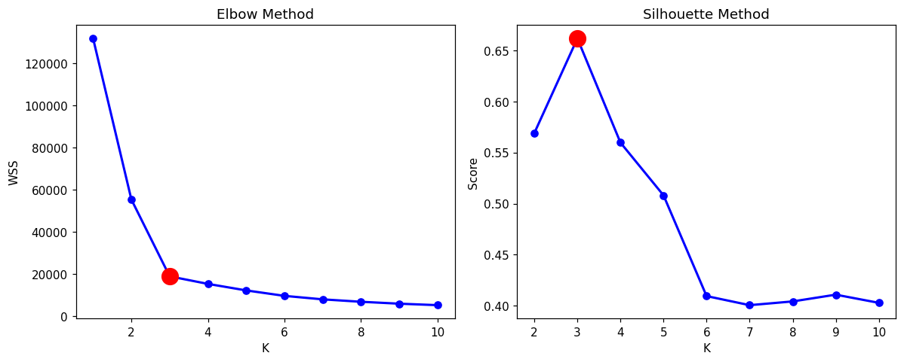

**Kết luận:**

- **Elbow gợi ý**: K = 3
- **Silhouette gợi ý**: K = 3
- **Quyết định cuối**: K = 3 (2 phương pháp đồng ý)

------------------------------------------------------------------------

## 2.5 Hierarchical Clustering

### 2.5.1 Giới thiệu

**Hierarchical Clustering (Phân cụm phân cấp)** xây dựng cây phân cấp
của các cụm.

**Khác biệt với K-Means:**

- ✅ **KHÔNG cần** chọn K trước
- ✅ Tạo **dendrogram** (cây phân cấp)
- ✅ Cho phép xem cấu trúc phân cấp
- ❌ Chậm hơn K-Means với dữ liệu lớn

### 2.5.2 Hai loại Hierarchical Clustering

**1. Agglomerative (Bottom-up)**

- Bắt đầu: Mỗi điểm là 1 cụm
- Lặp: Gộp 2 cụm gần nhất
- Kết thúc: Tất cả thành 1 cụm lớn

**2. Divisive (Top-down)**

- Bắt đầu: Tất cả là 1 cụm
- Lặp: Chia cụm xa nhất
- Kết thúc: Mỗi điểm là 1 cụm

**Trong Python (scipy, scikit-learn) chúng ta dùng Agglomerative** (phổ biến hơn)

### 2.5.3 Thuật toán Agglomerative

**Các bước:**

1.  Mỗi điểm là 1 cụm riêng (N cụm)
2.  Tính khoảng cách giữa TẤT CẢ cặp cụm
3.  Gộp 2 cụm gần nhất
4.  Lặp bước 2-3 cho đến khi còn 1 cụm

**Minh họa quá trình:**

```python
# Dữ liệu nhỏ (6 điểm)
small_data = pd.DataFrame({"x": [1, 2, 2, 8, 9, 9],
                           "y": [1, 1, 2, 8, 8, 9],
                           "label": [f"P{i}" for i in range(1, 7)]})
S = small_data[["x", "y"]].to_numpy()

# Nhãn cụm sau mỗi bước gộp
steps = [
    ("Bước 0: 6 cụm\nMỗi điểm 1 cụm",   [0, 1, 2, 3, 4, 5], []),
    ("Bước 1: 5 cụm\nGộp P1, P2",       [0, 0, 1, 2, 3, 4], [[0, 1]]),
    ("Bước 2: 4 cụm\nGộp {P1,P2}, P3",  [0, 0, 0, 1, 2, 3], [[0, 1, 2]]),
    ("Bước 3: 3 cụm\nGộp P4, P5",       [0, 0, 0, 1, 1, 2], [[0, 1, 2], [3, 4]]),
    ("Bước 4: 2 cụm\nGộp {P4,P5}, P6",  [0, 0, 0, 1, 1, 1], [[0, 1, 2], [3, 4, 5]]),
    ("Bước 5: 1 cụm\nGộp hết",          [0, 0, 0, 0, 0, 0], [[0, 1, 2], [3, 4, 5], [2, 3]]),
]

fig, axes = plt.subplots(2, 3, figsize=(15, 9))
for ax, (title, labs, links) in zip(axes.flat, steps):
    n_cum = len(set(labs))
    palette = plt.cm.rainbow(np.linspace(0, 1, n_cum)) if n_cum > 1 else ["purple"]
    ax.scatter(S[:, 0], S[:, 1], s=150, c=[palette[l] for l in labs])
    for (px, py), name in zip(S, small_data["label"]):
        ax.text(px, py + 0.5, name, fontweight="bold", ha="center")
    for idx in links:
        ax.plot(S[idx, 0], S[idx, 1], linewidth=2, color="gray")
    ax.set(xlim=(0, 10), ylim=(0, 10), xlabel="X", ylabel="Y", title=title)
plt.tight_layout()
plt.show()
```

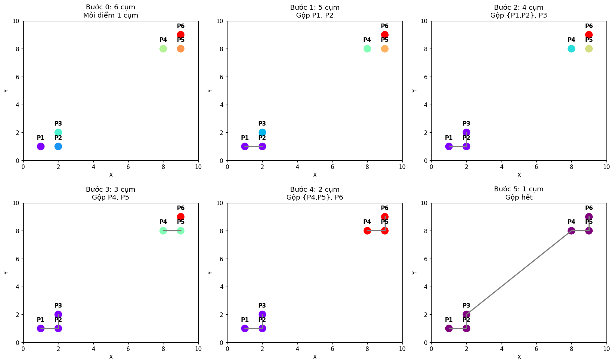

### 2.5.4 Linkage Methods

**Câu hỏi quan trọng:** Tính khoảng cách giữa 2 **CỤM** như thế nào?

Có 4 phương pháp chính (tham số `method` của `scipy.cluster.hierarchy.linkage`):

**1. Single Linkage (Min)** – `method="single"`

- Khoảng cách = min khoảng cách giữa 2 điểm bất kỳ
- Công thức: $`d(A, B) = \min_{a \in A, b \in B} d(a, b)`$
- Đặc điểm: Tạo chuỗi dài, nhạy cảm với outliers

**2. Complete Linkage (Max)** – `method="complete"`

- Khoảng cách = max khoảng cách giữa 2 điểm
- Công thức: $`d(A, B) = \max_{a \in A, b \in B} d(a, b)`$
- Đặc điểm: Tạo cụm chặt, kích thước đồng đều

**3. Average Linkage** – `method="average"`

- Khoảng cách = trung bình khoảng cách tất cả cặp điểm
- Công thức:
  $`d(A, B) = \frac{1}{|A||B|} \sum_{a \in A, b \in B} d(a, b)`$
- Đặc điểm: Cân bằng, phổ biến nhất

**4. Ward’s Method** – `method="ward"` (tương đương `ward.D2` trong R)

- Gộp 2 cụm làm tăng WSS (Within Sum of Squares) ít nhất
- Đặc điểm: Tạo cụm kích thước đều, tốt nhất trong nhiều TH

**Minh họa Linkage:**

```python
cluster_A = np.array([[1, 1], [2, 1.5], [1.5, 2]])
cluster_B = np.array([[8, 8], [9, 8.5], [8.5, 9]])
D = cdist(cluster_A, cluster_B)                 # Ma trận khoảng cách giữa 2 cụm
i_min, j_min = np.unravel_index(D.argmin(), D.shape)
i_max, j_max = np.unravel_index(D.argmax(), D.shape)

fig, axes = plt.subplots(2, 2, figsize=(10, 9))
titles = ["Single Linkage\n(Min distance)", "Complete Linkage\n(Max distance)",
          "Average Linkage\n(Avg all pairs)", "Ward's Method\n(Min increase WSS)"]
for ax, t in zip(axes.flat, titles):
    ax.scatter(*cluster_A.T, color="red", s=150)
    ax.scatter(*cluster_B.T, color="blue", s=150)
    ax.set(title=t, xlabel="X", ylabel="Y")

# Single: khoảng cách min
axes[0, 0].plot(*zip(cluster_A[i_min], cluster_B[j_min]), color="green", linewidth=3)
axes[0, 0].text(5, 5, f"MIN = {D.min():.2f}", color="green", fontweight="bold")

# Complete: khoảng cách max
axes[0, 1].plot(*zip(cluster_A[i_max], cluster_B[j_max]), color="orange", linewidth=3)
axes[0, 1].text(5, 5, f"MAX = {D.max():.2f}", color="orange", fontweight="bold")

# Average: tất cả các cặp
for a in cluster_A:
    for b in cluster_B:
        axes[1, 0].plot(*zip(a, b), color="purple", linestyle="--", linewidth=1)
axes[1, 0].text(5, 5, f"AVG = {D.mean():.2f}", color="purple", fontweight="bold")

# Ward: dựa trên centroids
for C_ in (cluster_A, cluster_B):
    axes[1, 1].scatter(*C_.mean(axis=0), marker="x", s=250, linewidths=3, color="black")
axes[1, 1].text(5, 5, "WSS", color="darkred", fontweight="bold")

plt.tight_layout()
plt.show()
```

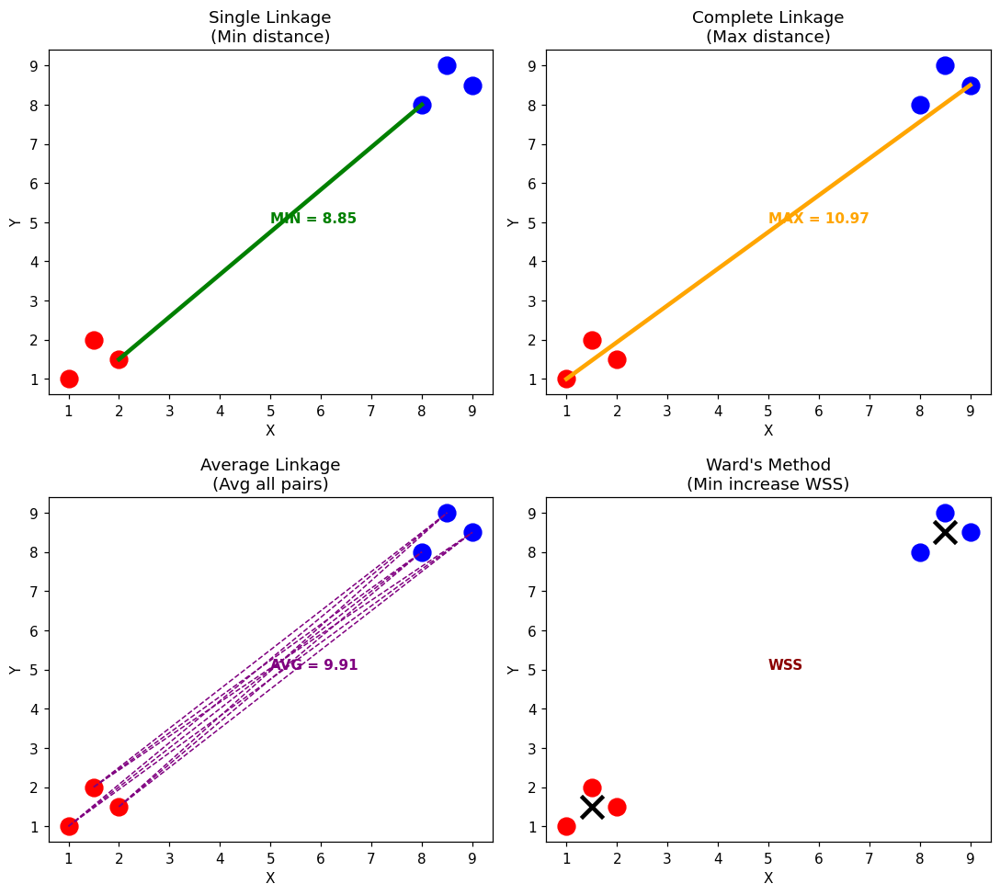

### 2.5.5 Dendrogram (Cây phân cấp)

**Dendrogram** là biểu đồ cây thể hiện quá trình gộp cụm.

**Cách đọc Dendrogram:**

- **Trục Y**: Khoảng cách/độ tương đồng
- **Chiều cao**: Khoảng cách giữa 2 cụm khi gộp
- **Cắt ngang**: Chọn số cụm K

Ta viết một hàm tiện ích tìm **độ cao cắt** để được đúng K cụm (tương đương `rect.hclust` trong R, các cụm sẽ được tô màu khác nhau):

```python
def nguong_cat(Z, k):
    """Độ cao cắt nằm giữa lần gộp thứ (k-1) và thứ k tính từ trên xuống → được đúng k cụm."""
    return (Z[-k, 2] + Z[-(k - 1), 2]) / 2

rng = np.random.default_rng(42)
customers_hc = pd.DataFrame({
    "Age": np.concatenate([rng.normal(25, 4, 70), rng.normal(45, 5, 60), rng.normal(65, 6, 70)]),
    "Income": np.concatenate([rng.normal(30, 8, 70), rng.normal(70, 10, 60), rng.normal(45, 8, 70)]),
})
H = customers_hc.to_numpy()

# Hierarchical clustering (R: hclust(dist(X), method = ...))
hc_complete = linkage(H, method="complete")
hc_average = linkage(H, method="average")
hc_ward = linkage(H, method="ward")

fig, axes = plt.subplots(3, 1, figsize=(12, 13))
for ax, (Z, name) in zip(axes, [(hc_complete, "Complete Linkage"),
                                (hc_average, "Average Linkage"),
                                (hc_ward, "Ward's Method")]):
    h = nguong_cat(Z, 3)
    dendrogram(Z, ax=ax, no_labels=True, color_threshold=h, above_threshold_color="gray")
    ax.axhline(h, color="blue", linestyle="--", linewidth=2)
    ax.set_title(f"Dendrogram - {name}")
axes[0].text(len(H) * 5, nguong_cat(hc_complete, 3) * 1.05, "Cắt ở đây → K=3",
             color="blue", fontweight="bold")
plt.tight_layout()
plt.show()
```

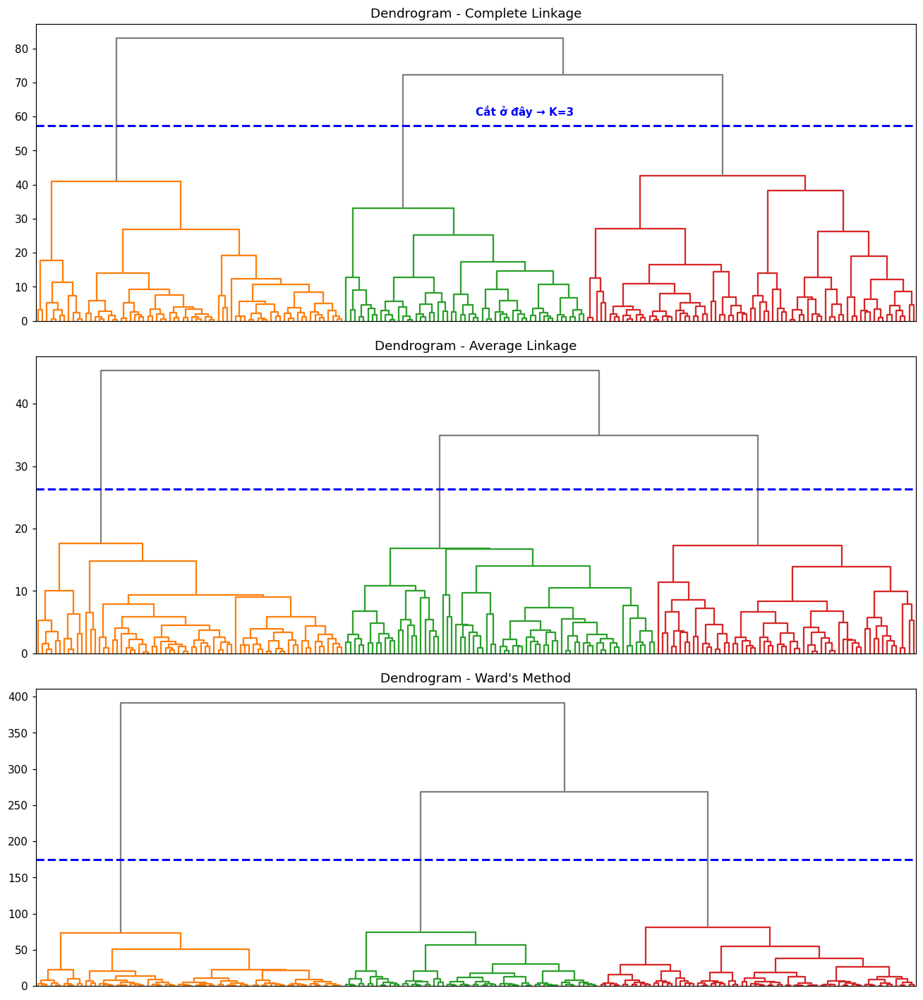

**Giải thích:**

- Màu các nhánh: 3 cụm thu được khi cắt
- Đường xanh đứt: Vị trí cắt để được K=3
- Càng cắt thấp → càng nhiều cụm
- Càng cắt cao → càng ít cụm

### 2.5.6 Chọn số cụm K

**Cách 1: Quan sát Dendrogram**

Tìm khoảng cách lớn nhất giữa các lần gộp → cắt ở đó

**Cách 2: Elbow Method với WSS**

```python
def tinh_wss(X, labels):
    """WSS: tổng bình phương khoảng cách từ mỗi điểm đến centroid cụm của nó (bỏ qua noise = 0)."""
    X = np.asarray(X)
    return sum(((X[labels == k] - X[labels == k].mean(axis=0)) ** 2).sum()
               for k in np.unique(labels) if k != 0)

# Tính WSS cho mỗi K (R: cutree(hc_ward, k))
wss_hc = [tinh_wss(H, fcluster(hc_ward, t=k, criterion="maxclust")) for k in range(2, 11)]

plt.plot(range(2, 11), wss_hc, marker="o", color="blue", linewidth=2)
plt.grid(linestyle=":")
plt.scatter(3, wss_hc[1], color="red", s=300, zorder=3)
plt.text(3.2, wss_hc[1] + 3000, "K = 3", color="red", fontweight="bold")
plt.xlabel("Số cụm K")
plt.ylabel("WSS")
plt.title("Elbow Method cho Hierarchical Clustering")
plt.show()
```

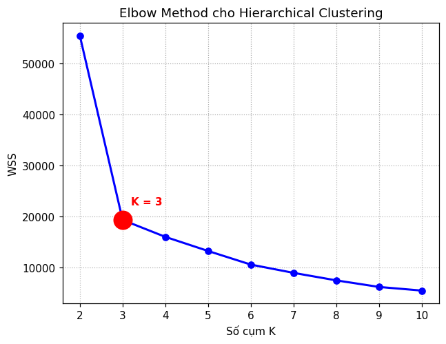

### 2.5.7 Triển khai hoàn chỉnh

```python
# Chọn K = 3 (R: cutree(hc_ward, k = 3)); fcluster đánh số cụm từ 1
clusters_hc = sap_xep_cum(fcluster(hc_ward, t=3, criterion="maxclust"), H[:, 0])

# So sánh với K-Means
km_compare = KMeans(n_clusters=3, n_init=25, random_state=42).fit(H)
clusters_km = sap_xep_cum(km_compare.labels_, H[:, 0])

fig, axes = plt.subplots(2, 2, figsize=(12, 10))

# Visualization
axes[0, 0].scatter(H[:, 0], H[:, 1], c=COLORS[clusters_hc - 1])
axes[0, 0].set(xlabel="Tuổi", ylabel="Thu nhập", title="Hierarchical Clustering\n(Ward's Method, K=3)")

axes[0, 1].scatter(H[:, 0], H[:, 1], c=COLORS[clusters_km - 1])
axes[0, 1].scatter(*km_compare.cluster_centers_.T, marker="x", s=200, linewidths=3, color="black")
axes[0, 1].set(xlabel="Tuổi", ylabel="Thu nhập", title="K-Means\n(K=3)")

# Dendrogram
h = nguong_cat(hc_ward, 3)
dendrogram(hc_ward, ax=axes[1, 0], no_labels=True, color_threshold=h, above_threshold_color="gray")
axes[1, 0].axhline(h, color="red", linestyle="--")
axes[1, 0].set_title("Dendrogram")

# Cluster sizes
sizes = np.bincount(clusters_hc)[1:]
axes[1, 1].bar([f"Cụm {k}" for k in range(1, 4)], sizes, color=COLORS[:3])
axes[1, 1].set(title="Kích thước các cụm", ylabel="Số điểm")

plt.tight_layout()
plt.show()
```

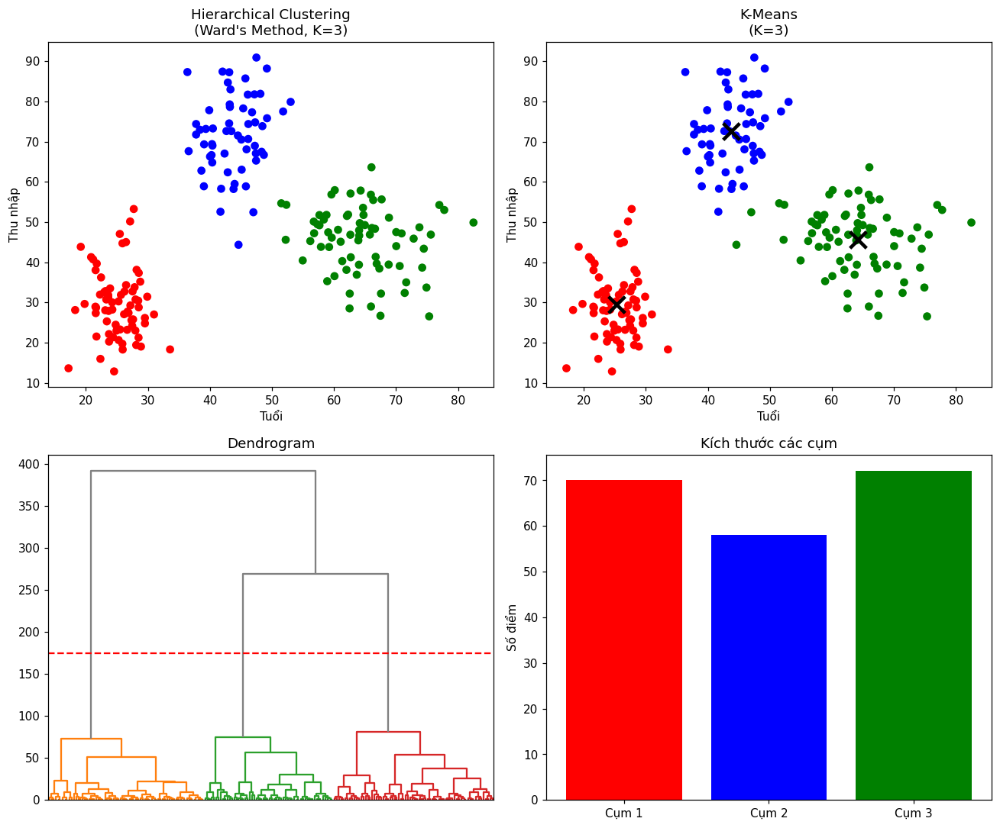

**Phân tích kết quả:**

```python
customers_hc.assign(Cum=clusters_hc).groupby("Cum").agg(
    So_luong=("Age", "size"),
    Tuoi_TB=("Age", "mean"),
    Thu_nhap_TB=("Income", "mean"),
).round(1)
```

```text
     So_luong  Tuoi_TB  Thu_nhap_TB
Cum                                
1          70     25.2         29.4
2          58     43.8         71.7
3          72     64.7         45.5
```

### 2.5.8 So sánh Hierarchical vs K-Means

| Tiêu chí | K-Means | Hierarchical |
|----|----|----|
| **Tốc độ** | Nhanh O(nkt) | Chậm O(n³) |
| **Chọn K** | Phải chọn trước | Có thể chọn sau |
| **Dendrogram** | Không | Có |
| **Dữ liệu lớn** | Tốt (hàng triệu điểm) | Kém (\< 10,000 điểm) |
| **Kết quả** | Khác nhau mỗi lần (n_init=1) | Cố định |
| **Hình dạng cụm** | Cầu (spherical) | Linh hoạt hơn |
| **Ứng dụng** | Phân khúc lớn, real-time | Phân tích khám phá, sinh học |

**Khi nào dùng Hierarchical?**

- ✅ Dữ liệu nhỏ (\< 10,000 điểm)
- ✅ Cần xem cấu trúc phân cấp
- ✅ Không biết K trước
- ✅ Cần kết quả ổn định

**Khi nào dùng K-Means?**

- ✅ Dữ liệu lớn
- ✅ Cần tốc độ
- ✅ Biết K trước
- ✅ Cụm hình cầu

> scikit-learn cũng có `AgglomerativeClustering(n_clusters=3, linkage="ward")` cho kết quả tương tự, tiện dùng trong Pipeline; còn `scipy` tiện hơn khi cần vẽ dendrogram.

------------------------------------------------------------------------

## 2.6 DBSCAN (Density-Based Spatial Clustering)

### 2.6.1 Giới thiệu

**DBSCAN** = Density-Based Spatial Clustering of Applications with Noise

**Ý tưởng cốt lõi:** Tìm cụm dựa trên **mật độ**, không phải khoảng
cách đến tâm cụm.

**Điểm mạnh:**

- ✅ KHÔNG cần chọn K trước
- ✅ Tìm được cụm **hình dạng bất kỳ** (không chỉ hình cầu)
- ✅ Tự động phát hiện **outliers** (noise)
- ✅ Ít nhạy cảm với thứ tự dữ liệu

**Điểm yếu:**

- ❌ Khó xác định tham số eps và minPts (`min_samples`)
- ❌ Không tốt với cụm có **mật độ khác nhau**
- ❌ Không tốt với dữ liệu **chiều cao**

### 2.6.2 Khái niệm cơ bản

**3 loại điểm:**

**1. Core Point (Điểm lõi)**

- Có ít nhất **minPts** điểm (tính cả chính nó) trong bán kính **eps**
- Là trung tâm của cụm

**2. Border Point (Điểm biên)**

- Nằm trong bán kính eps của core point
- Không đủ điểm láng giềng để là core point
- Thuộc cụm nhưng ở rìa

**3. Noise Point (Điểm nhiễu)**

- KHÔNG phải core, KHÔNG phải border
- Là **outlier**

> **Quy ước nhãn:** scikit-learn gán nhãn **-1** cho noise (gói `dbscan` của R gán **0**). Hàm `sap_xep_cum()` ở đầu bài đổi -1 thành 0 để thống nhất với tài liệu gốc.

**Minh họa 3 loại điểm:**

Ví dụ với eps = 1, minPts = 3: nhóm điểm quanh (2, 2) đủ dày → có điểm **core**; hai điểm (8, 8) và (8.3, 8.2) chỉ có 2 điểm trong bán kính eps (< minPts) nên **không** tạo được cụm; điểm (5, 5) đứng một mình → **noise**. Ta dùng chính `DBSCAN` để xác định loại của từng điểm:

```python
example_points = np.array([[2, 2], [2.5, 2.3], [2.2, 1.8], [2.8, 2.5], [2.1, 2.4],
                           [3.4, 3.0], [8, 8], [8.3, 8.2], [5, 5]])
eps, minPts = 1, 3

db_ex = DBSCAN(eps=eps, min_samples=minPts).fit(example_points)
is_core = np.zeros(len(example_points), dtype=bool)
is_core[db_ex.core_sample_indices_] = True
loai = np.where(is_core, "CORE", np.where(db_ex.labels_ != -1, "BORDER", "NOISE"))
print(pd.DataFrame({"x": example_points[:, 0], "y": example_points[:, 1],
                    "cum": db_ex.labels_, "loai": loai}))

fig, ax = plt.subplots(figsize=(7, 7))
style = {"CORE": ("red", "o"), "BORDER": ("lightblue", "o"), "NOISE": ("black", "x")}
for name, (c, m) in style.items():
    msk = loai == name
    ax.scatter(example_points[msk, 0], example_points[msk, 1], color=c, marker=m,
               s=200, linewidths=3, edgecolors="black" if m == "o" else None, label=f"{name} Point")

# Vẽ vòng tròn eps cho một điểm core, điểm border và điểm noise
for idx, c in [(0, "red"), (5, "blue"), (8, "gray")]:
    ax.add_patch(plt.Circle(example_points[idx], eps, fill=False, color=c, linewidth=2))
ax.set(xlim=(0, 10), ylim=(0, 10), aspect="equal", xlabel="X", ylabel="Y",
       title=f"DBSCAN: eps = {eps}, minPts = {minPts}")
ax.legend(loc="upper left")
plt.show()
```

```text
     x    y  cum    loai
0  2.0  2.0    0    CORE
1  2.5  2.3    0    CORE
2  2.2  1.8    0    CORE
3  2.8  2.5    0    CORE
4  2.1  2.4    0    CORE
5  3.4  3.0    0  BORDER
6  8.0  8.0   -1   NOISE
7  8.3  8.2   -1   NOISE
8  5.0  5.0   -1   NOISE
```

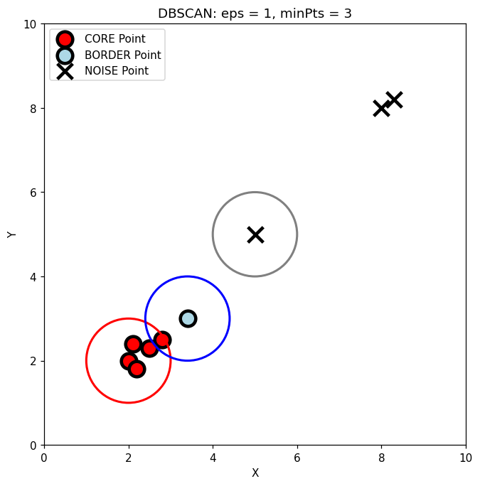

### 2.6.3 Hai tham số quan trọng

**1. eps (epsilon)** – tham số `eps`

- Bán kính vùng láng giềng
- eps nhỏ → nhiều cụm nhỏ + nhiều noise
- eps lớn → ít cụm lớn + ít noise

**2. minPts (minimum points)** – tham số `min_samples` trong scikit-learn

- Số điểm tối thiểu để là core point
- minPts nhỏ → nhiều core points
- minPts lớn → ít core points, nhiều noise
- **Khuyến nghị**: minPts ≥ số chiều + 1

**Ảnh hưởng của eps và minPts:**

```python
rng = np.random.default_rng(123)
data_dbscan = np.column_stack([
    np.concatenate([rng.normal(2, 0.5, 50), rng.normal(8, 0.6, 50), rng.normal(5, 0.5, 50)]),
    np.concatenate([rng.normal(2, 0.5, 50), rng.normal(3, 0.6, 50), rng.normal(7, 0.5, 50)]),
])

settings = [(0.3, 5, "Quá nhỏ → Nhiều noise"), (0.8, 5, "Vừa phải"), (4.5, 5, "Quá lớn → 1 cụm"),
            (0.4, 3, "minPts nhỏ → nhiều cụm nhỏ"), (0.8, 5, "Vừa phải"), (0.4, 10, "minPts lớn → Nhiều noise")]

def ve_dbscan(ax, X, labels, title):
    noise = labels == -1
    ax.scatter(X[~noise, 0], X[~noise, 1], c=labels[~noise], cmap="tab10", vmin=0, vmax=9)
    ax.scatter(X[noise, 0], X[noise, 1], color="black", marker="x", linewidths=2)
    ax.set_title(title)

fig, axes = plt.subplots(2, 3, figsize=(15, 9))
results = []
for ax, (e, m, note) in zip(axes.flat, settings):
    lab = DBSCAN(eps=e, min_samples=m).fit_predict(data_dbscan)
    ve_dbscan(ax, data_dbscan, lab, f"eps = {e}, minPts = {m}\n{note}")
    results.append({"Setting": f"eps={e}, minPts={m}",
                    "So_cum": lab.max() + 1, "So_noise": int((lab == -1).sum())})
plt.tight_layout()
plt.show()
```

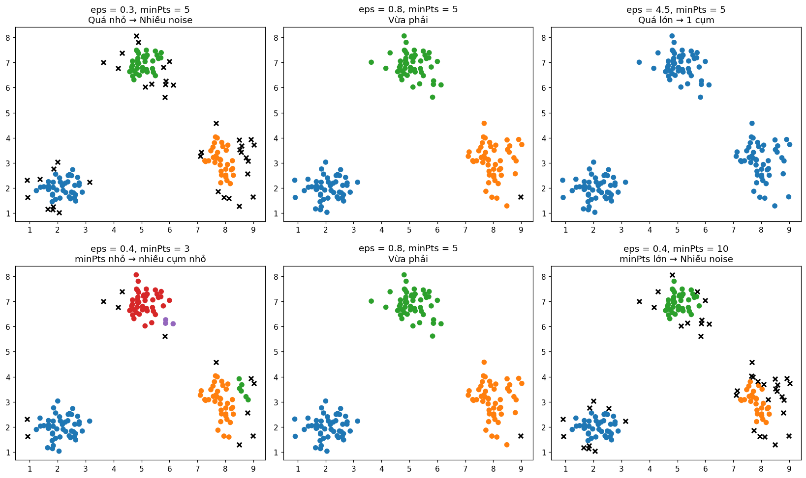

**Kết quả với các tham số:**

```python
pd.DataFrame(results)
```

```text
              Setting  So_cum  So_noise
0   eps=0.3, minPts=5       3        40
1   eps=0.8, minPts=5       3         1
2   eps=4.5, minPts=5       1         0
3   eps=0.4, minPts=3       5        12
4   eps=0.8, minPts=5       3         1
5  eps=0.4, minPts=10       3        44
```

### 2.6.4 Thuật toán DBSCAN

**Các bước:**

1.  Chọn 1 điểm chưa thăm ngẫu nhiên
2.  Tìm tất cả điểm trong bán kính eps
3.  Nếu số điểm ≥ minPts → Tạo cụm mới
4.  Mở rộng cụm bằng cách tìm láng giềng của láng giềng
5.  Lặp lại với điểm chưa thăm tiếp theo
6.  Điểm không thuộc cụm nào → Noise

**Minh họa thuật toán:**

```python
small_db = np.array([[1, 1], [1.5, 1.3], [1.2, 0.8], [2, 1.5], [2.3, 1.8],
                     [8, 8], [8.5, 8.3], [8.2, 7.8], [9, 8.5], [5, 5]])
eps_val, minPts_val = 1, 3

final = DBSCAN(eps=eps_val, min_samples=minPts_val).fit_predict(small_db)
print("Nhãn cuối cùng (-1 = noise):", final)

# Số láng giềng của điểm 1 trong bán kính eps (không tính chính nó)
n_nb_1 = (np.linalg.norm(small_db - small_db[0], axis=1) < eps_val).sum() - 1

fig, axes = plt.subplots(3, 2, figsize=(10, 13))
steps = [
    ("Bước 1: Chưa gán nhãn", np.full(10, -2), None),
    (f"Bước 2: Điểm 1 có {n_nb_1} láng giềng", np.full(10, -2), (0, "red")),
    ("Bước 3: Cụm 1 (điểm 1-5)", np.where(final == 0, 0, -2), None),
    ("Bước 4: Điểm 6 có láng giềng", np.where(final == 0, 0, -2), (5, "blue")),
    ("Bước 5: Cụm 2 (điểm 6-9)", np.where(final >= 0, final, -2), None),
    ("Bước 6: Điểm 10 = NOISE", final, None),
]
color_of = {-2: "gray", -1: "black", 0: "red", 1: "blue"}
for ax, (title, labs, circle) in zip(axes.flat, steps):
    for (px, py), l in zip(small_db, labs):
        ax.scatter(px, py, s=150, color=color_of[l], marker="x" if l == -1 else "o", linewidths=2)
    for i, (px, py) in enumerate(small_db):
        ax.text(px, py + 0.4, str(i + 1), fontweight="bold", ha="center")
    if circle:
        idx, c = circle
        ax.add_patch(plt.Circle(small_db[idx], eps_val, fill=False, color=c, linewidth=2))
    ax.set(xlim=(0, 10), ylim=(0, 10), title=title, xlabel="X", ylabel="Y")
plt.tight_layout()
plt.show()
```

```text
Nhãn cuối cùng (-1 = noise): [ 0  0  0  0  0  1  1  1  1 -1]
```

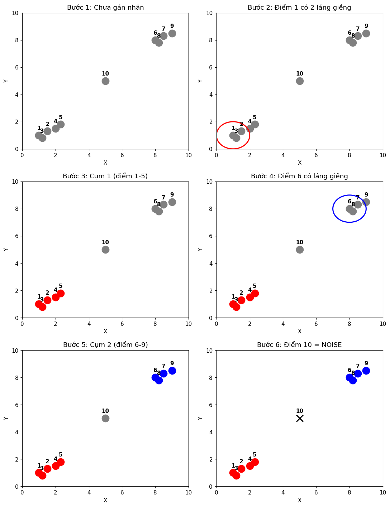

### 2.6.5 Chọn eps tối ưu: k-distance graph

**Phương pháp k-NN distance:**

1.  Với mỗi điểm, tính khoảng cách đến láng giềng thứ k (k = minPts)
2.  Sắp xếp khoảng cách tăng dần
3.  Vẽ biểu đồ
4.  Tìm điểm “khuỷu tay” → eps tối ưu

```python
def knn_dist(X, k):
    """Khoảng cách từ mỗi điểm đến láng giềng gần thứ k (không tính chính nó) – R: dbscan::kNNdist."""
    nn = NearestNeighbors(n_neighbors=k + 1).fit(X)
    distances, _ = nn.kneighbors(X)
    return distances[:, k]

k = 5  # minPts
knn_sorted = np.sort(knn_dist(data_dbscan, k))

plt.plot(knn_sorted, color="blue", linewidth=2)
plt.grid(linestyle=":")

# Đánh dấu elbow
plt.axhline(0.8, color="red", linestyle="--", linewidth=2)
plt.text(20, 0.85, "eps ≈ 0.8", color="red", fontweight="bold")

plt.xlabel("Điểm (sắp xếp)")
plt.ylabel(f"{k}-NN Distance")
plt.title("k-NN Distance Graph\nTìm eps tối ưu")
plt.show()
```

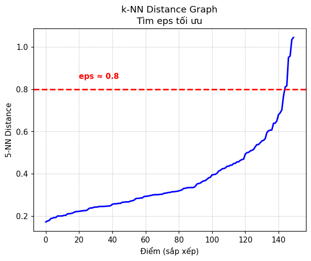

**Giải thích:**

- Trước elbow: Điểm gần nhau (trong cụm)
- Sau elbow: Điểm xa nhau (noise/outliers)
- Chọn eps ≈ giá trị tại elbow

### 2.6.6 Ưu điểm của DBSCAN

**1. Tìm cụm hình dạng bất kỳ**

```python
rng = np.random.default_rng(123)

# Hình vòng tròn
theta_vals = np.linspace(0, 2 * np.pi, 100)
circle_data = np.column_stack([5 + 3 * np.cos(theta_vals) + rng.normal(0, 0.2, 100),
                               5 + 3 * np.sin(theta_vals) + rng.normal(0, 0.2, 100)])
# Điểm trung tâm
center_data = rng.normal(5, 0.3, size=(50, 2))
# Noise
noise_data = rng.uniform(0, 10, size=(20, 2))

complex_data = np.vstack([circle_data, center_data, noise_data])

fig, axes = plt.subplots(1, 2, figsize=(11, 5))

# K-Means (THẤT BẠI)
km_complex = KMeans(n_clusters=2, n_init=25, random_state=42).fit(complex_data)
axes[0].scatter(*complex_data.T, c=COLORS[km_complex.labels_])
axes[0].scatter(*km_complex.cluster_centers_.T, marker="x", s=250, linewidths=3, color="black")
axes[0].set(title="K-Means: THẤT BẠI\nKhông nhận dạng được hình vòng", xlabel="X", ylabel="Y")

# DBSCAN (THÀNH CÔNG)
db_complex = DBSCAN(eps=0.5, min_samples=5).fit_predict(complex_data)
ve_dbscan(axes[1], complex_data, db_complex, "DBSCAN: THÀNH CÔNG\nNhận dạng 2 cụm + noise")
axes[1].set(xlabel="X", ylabel="Y")
plt.tight_layout()
plt.show()
```

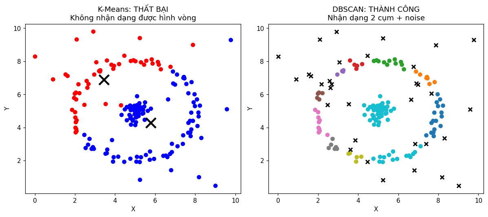

**2. Tự động phát hiện outliers**

```python
rng = np.random.default_rng(456)
normal_pts = rng.normal(5, 1, size=(100, 2))
outliers_pts = np.array([[0, 0], [10, 0], [0, 10], [10, 10]])
data_with_outliers = np.vstack([normal_pts, outliers_pts])

fig, axes = plt.subplots(1, 2, figsize=(11, 5))

# K-Means bị ảnh hưởng
km_out = KMeans(n_clusters=2, n_init=25, random_state=42).fit(data_with_outliers)
axes[0].scatter(*data_with_outliers.T, c=COLORS[km_out.labels_])
axes[0].scatter(*km_out.cluster_centers_.T, marker="x", s=250, linewidths=3, color="black")
axes[0].set(title="K-Means\nBị ảnh hưởng bởi outliers", xlabel="X", ylabel="Y")

# DBSCAN loại bỏ outliers (eps lớn hơn một chút cho đám mây SD = 1)
db_out = DBSCAN(eps=1.0, min_samples=5).fit_predict(data_with_outliers)
noise = db_out == -1
axes[1].scatter(*data_with_outliers[~noise].T, color="red")
axes[1].scatter(*data_with_outliers[noise].T, color="black", marker="x", s=80, linewidths=2)
axes[1].set(title="DBSCAN\nTự động phát hiện outliers", xlabel="X", ylabel="Y")
plt.tight_layout()
plt.show()

print("Số điểm DBSCAN coi là noise:", noise.sum())
```

```text
Số điểm DBSCAN coi là noise: 4
```

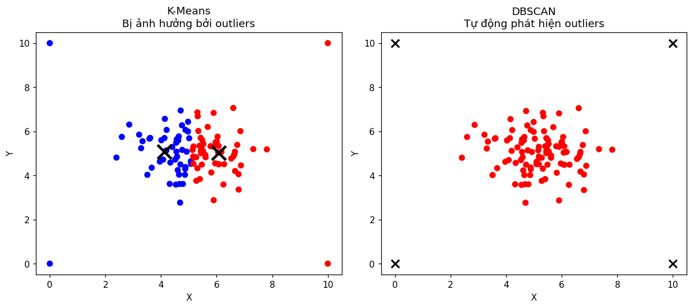

### 2.6.7 Ví dụ thực tế

```python
customers_db = customers_hc.copy()      # Dùng lại dữ liệu khách hàng 2 biến (Age, Income)
Xdb = customers_db.to_numpy()

# Tìm eps tối ưu
knn_dist_cust = np.sort(knn_dist(Xdb, 5))
eps_optimal = 6.5                        # Đọc từ k-NN graph (vùng "khuỷu tay")

# DBSCAN
db_customers = sap_xep_cum(DBSCAN(eps=eps_optimal, min_samples=5).fit_predict(Xdb), Xdb[:, 0])
n_cum = db_customers.max()

fig, axes = plt.subplots(2, 2, figsize=(12, 10))

# k-NN distance graph
axes[0, 0].plot(knn_dist_cust, color="blue", linewidth=2)
axes[0, 0].axhline(eps_optimal, color="red", linestyle="--", linewidth=2)
axes[0, 0].set(title=f"k-NN Distance\nChọn eps ≈ {eps_optimal}", xlabel="Điểm", ylabel="5-NN Distance")

# DBSCAN result
for k in range(1, n_cum + 1):
    m = db_customers == k
    axes[0, 1].scatter(*Xdb[m].T, color=COLORS[k - 1], label=f"Cụm {k}")
axes[0, 1].scatter(*Xdb[db_customers == 0].T, color="black", marker="x", s=80, linewidths=2, label="Noise")
axes[0, 1].set(xlabel="Tuổi", ylabel="Thu nhập", title=f"DBSCAN: eps = {eps_optimal}, minPts = 5")
axes[0, 1].legend(loc="upper right")

# So sánh với K-Means
axes[1, 0].scatter(*Xdb.T, c=COLORS[clusters_km - 1])
axes[1, 0].scatter(*km_compare.cluster_centers_.T, marker="x", s=200, linewidths=3, color="black")
axes[1, 0].set(xlabel="Tuổi", ylabel="Thu nhập", title="K-Means (K=3)")

# Cluster sizes
counts = np.bincount(db_customers, minlength=n_cum + 1)
axes[1, 1].bar(["Noise"] + [f"Cụm {k}" for k in range(1, n_cum + 1)], counts,
               color=["black"] + list(COLORS[:n_cum]))
axes[1, 1].set(title="Phân bố điểm", ylabel="Số điểm")

plt.tight_layout()
plt.show()
```

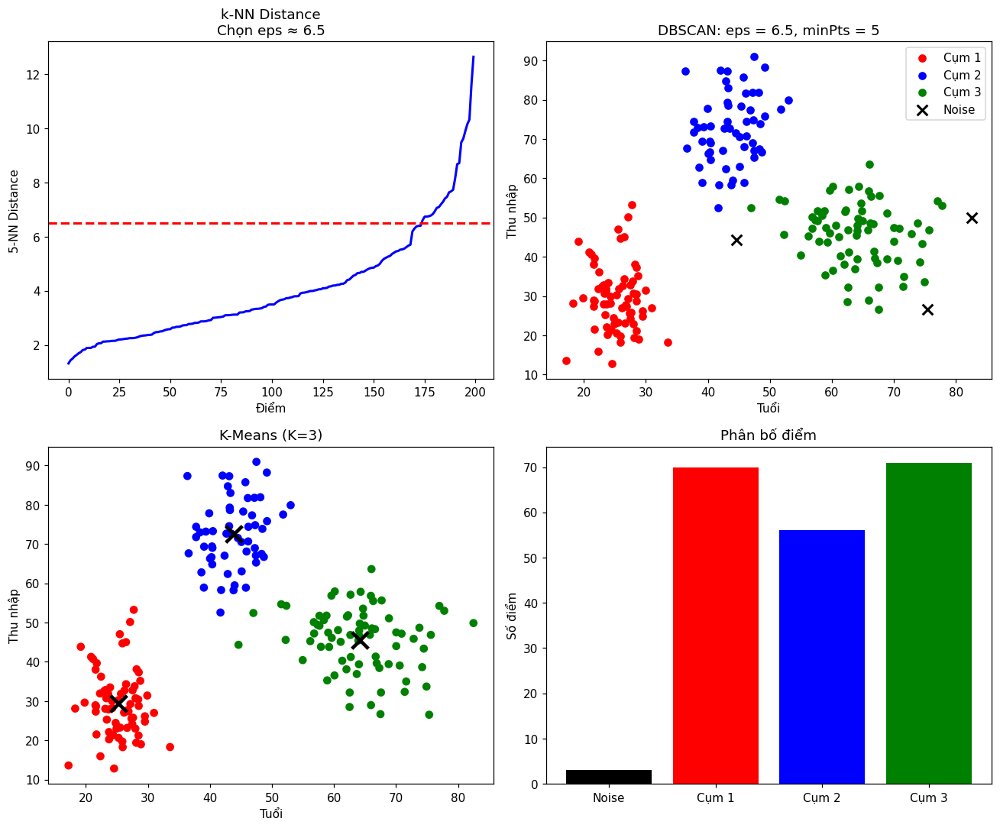

**Phân tích kết quả:**

```python
# Loại bỏ noise
valid = customers_db.assign(Cum=db_customers).query("Cum != 0")
print(valid.groupby("Cum").agg(So_luong=("Age", "size"),
                               Tuoi_TB=("Age", "mean"),
                               Thu_nhap_TB=("Income", "mean")).round(1))

# Số noise
print("\nSố điểm noise:", (db_customers == 0).sum())
```

```text
     So_luong  Tuoi_TB  Thu_nhap_TB
Cum                                
1          70     25.2         29.4
2          56     43.8         72.6
3          71     64.0         45.8

Số điểm noise: 3
```

### 2.6.8 So sánh 3 thuật toán

```python
fig, axes = plt.subplots(1, 3, figsize=(16, 5))

# K-Means
axes[0].scatter(*Xdb.T, c=COLORS[clusters_km - 1])
axes[0].scatter(*km_compare.cluster_centers_.T, marker="x", s=200, linewidths=3, color="black")
axes[0].set(xlabel="Tuổi", ylabel="Thu nhập", title="K-Means")

# Hierarchical
axes[1].scatter(*Xdb.T, c=COLORS[clusters_hc - 1])
axes[1].set(xlabel="Tuổi", ylabel="Thu nhập", title="Hierarchical")

# DBSCAN
m = db_customers > 0
axes[2].scatter(*Xdb[m].T, c=COLORS[db_customers[m] - 1])
axes[2].scatter(*Xdb[~m].T, color="black", marker="x", s=80, linewidths=2)
axes[2].set(xlabel="Tuổi", ylabel="Thu nhập", title="DBSCAN")

plt.tight_layout()
plt.show()
```

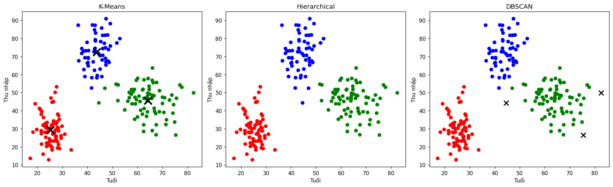

**Bảng tổng hợp:**

| Tiêu chí        | K-Means      | Hierarchical | DBSCAN                |
|-----------------|--------------|--------------|-----------------------|
| **Chọn K**      | Phải chọn    | Chọn sau     | Tự động               |
| **Hình dạng**   | Hình cầu     | Linh hoạt    | Bất kỳ                |
| **Outliers**    | Nhạy cảm     | Nhạy cảm     | Tự phát hiện          |
| **Tốc độ**      | Nhanh O(nkt) | Chậm O(n³)   | Trung bình O(n log n) |
| **Dữ liệu lớn** | Tốt          | Kém          | Khá tốt               |
| **Tham số**     | K, n_init    | K, linkage   | eps, min_samples      |
| **Kết quả**     | Khác nhau    | Cố định      | Cố định               |

**Khi nào dùng DBSCAN?**

- ✅ Cụm hình dạng phức tạp
- ✅ Có nhiều outliers
- ✅ Không biết K trước
- ✅ Cần tự động phát hiện noise

------------------------------------------------------------------------

## 2.7 Dự án thực hành: So sánh 3 thuật toán Clustering

### 2.7.1 Mô tả dự án

**Bài toán:** Phân khúc khách hàng của một cửa hàng bán lẻ

**Dữ liệu:** 274 khách hàng với 3 đặc điểm:

- Tuổi (Age)
- Thu nhập hàng tháng (Income)
- Điểm chi tiêu hàng năm (Spending Score: 1-100)

**Mục tiêu:**

1. Áp dụng 3 thuật toán: K-Means, Hierarchical, DBSCAN
2. So sánh kết quả
3. Đánh giá bằng các chỉ số
4. Đưa ra khuyến nghị thuật toán phù hợp nhất

### 2.7.2 Chuẩn bị dữ liệu

```python
rng = np.random.default_rng(2026)

def tao_nhom(n, age, income, spending):
    return pd.DataFrame({"Age": rng.normal(*age, n),
                         "Income": rng.normal(*income, n),
                         "Spending": rng.normal(*spending, n)})

# Nhóm 1: Sinh viên - Trẻ, thu nhập thấp, chi tiêu thấp
group1 = tao_nhom(80, (22, 3), (25, 5), (30, 8))
# Nhóm 2: Trung niên - Trung tuổi, thu nhập cao, chi tiêu cao
group2 = tao_nhom(100, (45, 6), (80, 12), (75, 10))
# Nhóm 3: Người cao tuổi - Lớn tuổi, thu nhập trung bình, chi tiêu vừa
group3 = tao_nhom(90, (65, 5), (50, 8), (50, 10))
# Nhóm 4: Outliers - Một số khách hàng đặc biệt
outliers = pd.DataFrame({"Age": [18, 75, 30, 55],
                         "Income": [15, 120, 90, 35],
                         "Spending": [95, 20, 10, 90]})

# Gộp tất cả
customers_project = pd.concat([group1, group2, group3, outliers], ignore_index=True)
customers_project.insert(0, "CustomerID", np.arange(1, len(customers_project) + 1))

# Xem dữ liệu
customers_project.head(10)
```

```text
   CustomerID        Age     Income   Spending
0           1  19.620633  32.637122  34.970339
1           2  22.721714  21.404605  53.344693
2           3  16.311021  25.286695  37.518328
3           4  26.187315  27.327496  22.464074
4           5  23.914884  26.865801  51.308322
5           6  21.123858  18.830992  22.637456
6           7  21.064152  21.679686  36.309909
7           8  22.911506  24.020099  35.945021
8           9  21.197019  20.731503  22.962216
9          10  21.322273  28.386626  41.162789
```

**Thống kê mô tả:**

```python
customers_project[["Age", "Income", "Spending"]].describe().round(2)
```

```text
          Age  Income  Spending
count  274.00  274.00    274.00
mean    44.93   54.16     54.03
std     17.76   25.31     20.77
min     16.31   12.70      0.02
25%     25.86   30.27     36.60
50%     45.37   52.08     53.42
75%     61.85   75.13     70.57
max     79.84  120.00    107.36
```

**Visualization dữ liệu gốc:**

```python
cp = customers_project
fig, axes = plt.subplots(2, 2, figsize=(11, 9))

axes[0, 0].scatter(cp["Age"], cp["Income"], color="steelblue")
axes[0, 0].set(xlabel="Tuổi", ylabel="Thu nhập (triệu/tháng)", title="Age vs Income")

axes[0, 1].scatter(cp["Age"], cp["Spending"], color="steelblue")
axes[0, 1].set(xlabel="Tuổi", ylabel="Spending Score (0-100)", title="Age vs Spending Score")

axes[1, 0].scatter(cp["Income"], cp["Spending"], color="steelblue")
axes[1, 0].set(xlabel="Thu nhập", ylabel="Spending Score", title="Income vs Spending Score")

axes[1, 1].hist(cp["Age"], bins=20, color="lightblue", edgecolor="white")
axes[1, 1].set(xlabel="Tuổi", title="Phân bố Tuổi")
plt.tight_layout()
plt.show()
```

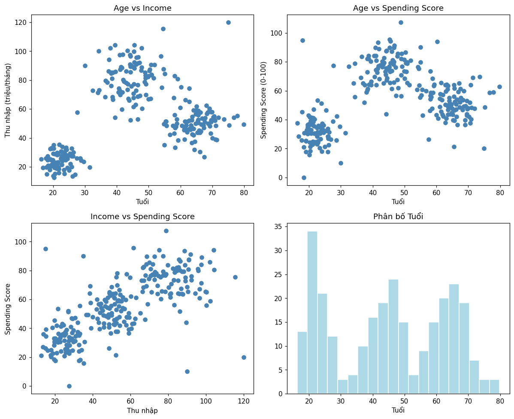

Ta viết sẵn một hàm vẽ 3 cặp biến + kích thước cụm để dùng lại cho cả 3 thuật toán:

```python
def ve_4_bieu_do(df, labels, ten, centers=None):
    """labels: 0 = noise, 1..K = cụm."""
    pairs = [("Age", "Income", "Tuổi", "Thu nhập"),
             ("Age", "Spending", "Tuổi", "Spending Score"),
             ("Income", "Spending", "Thu nhập", "Spending Score")]
    fig, axes = plt.subplots(2, 2, figsize=(11, 9))
    for ax, (a, b, la, lb) in zip(axes.flat, pairs):
        m = labels > 0
        ax.scatter(df.loc[m, a], df.loc[m, b], c=COLORS[labels[m] - 1])
        ax.scatter(df.loc[~m, a], df.loc[~m, b], color="black", marker="x", s=80, linewidths=2)
        if centers is not None:
            ax.scatter(centers[a], centers[b], marker="x", s=200, linewidths=3, color="black")
        ax.set(xlabel=la, ylabel=lb, title=f"{ten}: {a} vs {b}")
    K = labels.max()
    counts = np.bincount(labels, minlength=K + 1)
    names = [f"Cụm {k}" for k in range(1, K + 1)]
    if counts[0] > 0:
        axes[1, 1].bar(["Noise"] + names, counts, color=["black"] + list(COLORS[:K]))
    else:
        axes[1, 1].bar(names, counts[1:], color=COLORS[:K])
    axes[1, 1].set(title=f"{ten}: Kích thước cụm", ylabel="Số khách hàng")
    plt.tight_layout()
    plt.show()
```

### 2.7.3 Thuật toán 1: K-Means

**Bước 1: Chọn K tối ưu bằng Elbow Method**

```python
# Chuẩn bị dữ liệu (bỏ CustomerID)
data_clustering = customers_project[["Age", "Income", "Spending"]]
Xp = data_clustering.to_numpy()

# Tính WSS cho K = 1 đến 10
wss_kmeans = np.array([KMeans(n_clusters=k, n_init=25, random_state=42).fit(Xp).inertia_
                       for k in range(1, 11)])

fig, axes = plt.subplots(1, 2, figsize=(11, 4.5))

# Elbow plot
axes[0].plot(range(1, 11), wss_kmeans, marker="o", color="blue", linewidth=2)
axes[0].grid(linestyle=":")
axes[0].scatter(3, wss_kmeans[2], color="red", s=300, zorder=3)
axes[0].text(3.3, wss_kmeans[2] + 20000, "K = 3", color="red", fontweight="bold")
axes[0].set(xlabel="Số cụm K", ylabel="WSS", title="K-Means: Elbow Method")

# % giảm
pct_decrease_km = -np.diff(wss_kmeans) / wss_kmeans[:-1] * 100
axes[1].plot(range(2, 11), pct_decrease_km, marker="o", color="darkgreen", linewidth=2)
axes[1].axhline(10, color="red", linestyle="--")
axes[1].set(xlabel="K", ylabel="% Giảm WSS", title="Tốc độ giảm WSS")
plt.tight_layout()
plt.show()
```

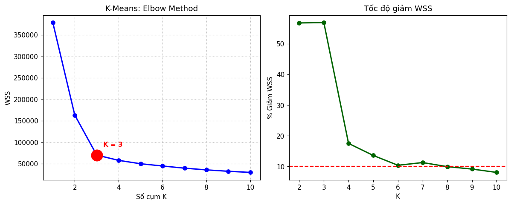

**Bước 2: Áp dụng K-Means với K = 3**

```python
km_result = KMeans(n_clusters=3, n_init=50, random_state=42).fit(Xp)

# Gán nhãn (đánh số lại: Cụm 1 = nhóm trẻ nhất)
km_labels = sap_xep_cum(km_result.labels_, Xp[:, 0])
customers_project["KMeans_Cluster"] = km_labels

# Centroids
km_centers = data_clustering.groupby(km_labels).mean()
km_centers.round(2)
```

```text
     Age  Income  Spending
1  22.31   24.63     31.94
2  45.03   82.18     74.07
3  64.54   49.75     51.72
```

**Bước 3: Visualization**

```python
ve_4_bieu_do(customers_project, km_labels, "K-Means", centers=km_centers)
```

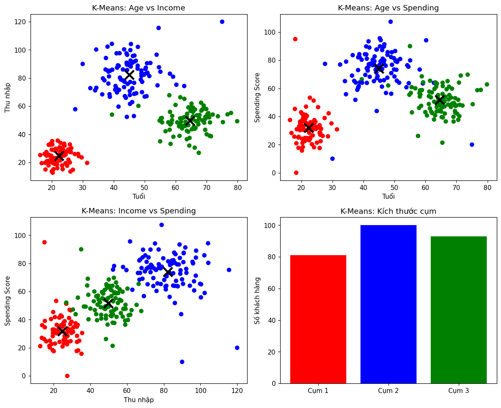

### 2.7.4 Thuật toán 2: Hierarchical Clustering

**Bước 1: Xây dựng Dendrogram**

```python
# Hierarchical clustering (Ward's method) – scipy tự tính ma trận khoảng cách
hc_result = linkage(Xp, method="ward")

h_cut = nguong_cat(hc_result, 3)
plt.figure(figsize=(12, 5))
dendrogram(hc_result, no_labels=True, color_threshold=h_cut, above_threshold_color="gray")
plt.axhline(h_cut, color="blue", linestyle="--", linewidth=2)
plt.text(len(Xp) * 5, h_cut * 1.08, "Cắt ở đây → K = 3", color="blue", fontweight="bold")
plt.title("Hierarchical Clustering: Dendrogram (Ward's Method)")
plt.show()
```

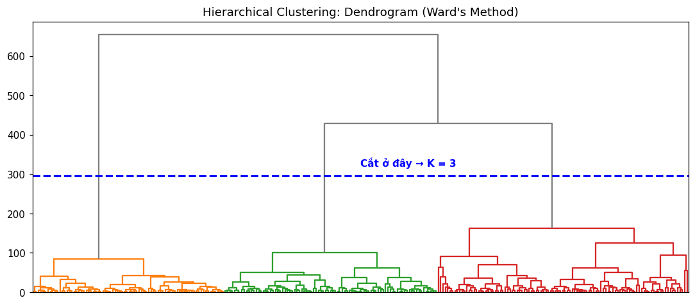

**Bước 2: Chọn K = 3 và gán nhãn**

```python
# Cắt dendrogram tại K = 3
hc_labels = sap_xep_cum(fcluster(hc_result, t=3, criterion="maxclust"), Xp[:, 0])

# Gán nhãn
customers_project["HC_Cluster"] = hc_labels

# Kích thước cụm
pd.Series(hc_labels).value_counts().sort_index()
```

```text
1     80
2    105
3     89
```

**Bước 3: Visualization**

```python
ve_4_bieu_do(customers_project, hc_labels, "Hierarchical")
```

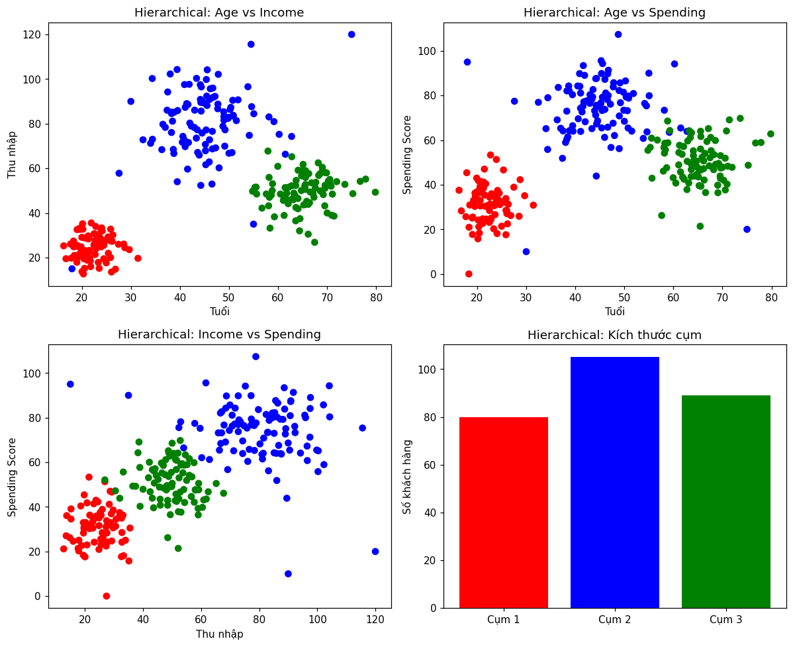

### 2.7.5 Thuật toán 3: DBSCAN

**Bước 1: Tìm eps tối ưu bằng k-NN distance**

```python
knn_sorted = np.sort(knn_dist(Xp, 5))

plt.plot(knn_sorted, color="blue", linewidth=2)
plt.grid(linestyle=":")

# Đánh dấu elbow
eps_optimal = 12
plt.axhline(eps_optimal, color="red", linestyle="--", linewidth=2)
plt.text(20, eps_optimal + 1, f"eps ≈ {eps_optimal}", color="red", fontweight="bold")
plt.xlabel("Điểm (sắp xếp)")
plt.ylabel("5-NN Distance")
plt.title("DBSCAN: k-NN Distance Graph")
plt.show()
```

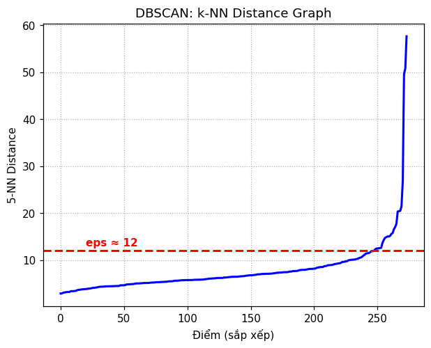

**Bước 2: Áp dụng DBSCAN**

```python
db_raw = DBSCAN(eps=eps_optimal, min_samples=5).fit_predict(Xp)

# Gán nhãn (0 = noise)
db_labels = sap_xep_cum(db_raw, Xp[:, 0])
customers_project["DBSCAN_Cluster"] = db_labels

# Kết quả
print(pd.Series(db_labels).value_counts().sort_index())

# Số cụm và noise
print("\nSố cụm :", db_labels.max())
print("Số noise:", (db_labels == 0).sum())
```

```text
0     12
1     79
2    183
Name: count, dtype: int64

Số cụm : 2
Số noise: 12
```

**Bước 3: Visualization**

```python
ve_4_bieu_do(customers_project, db_labels, "DBSCAN")
```

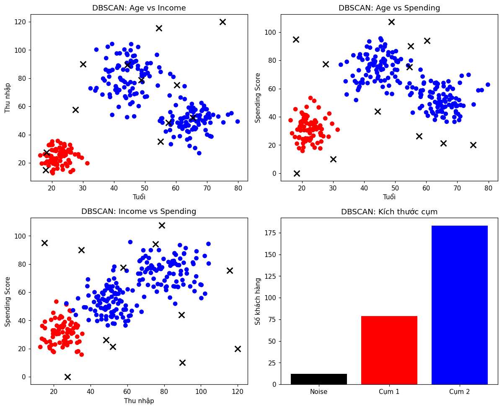

### 2.7.6 So sánh trực quan 3 thuật toán

```python
pairs = [("Age", "Income"), ("Age", "Spending"), ("Income", "Spending")]
fig, axes = plt.subplots(3, 3, figsize=(15, 14))
for row, (ten, labs) in enumerate([("K-Means", km_labels),
                                   ("Hierarchical", hc_labels),
                                   ("DBSCAN", db_labels)]):
    for col, (a, b) in enumerate(pairs):
        ax = axes[row, col]
        m = labs > 0
        ax.scatter(cp.loc[m, a], cp.loc[m, b], c=COLORS[labs[m] - 1])
        ax.scatter(cp.loc[~m, a], cp.loc[~m, b], color="black", marker="x", s=80, linewidths=2)
        ax.set(title=f"{ten}: {a} vs {b}", xlabel=a, ylabel=b)
plt.tight_layout()
plt.show()
```

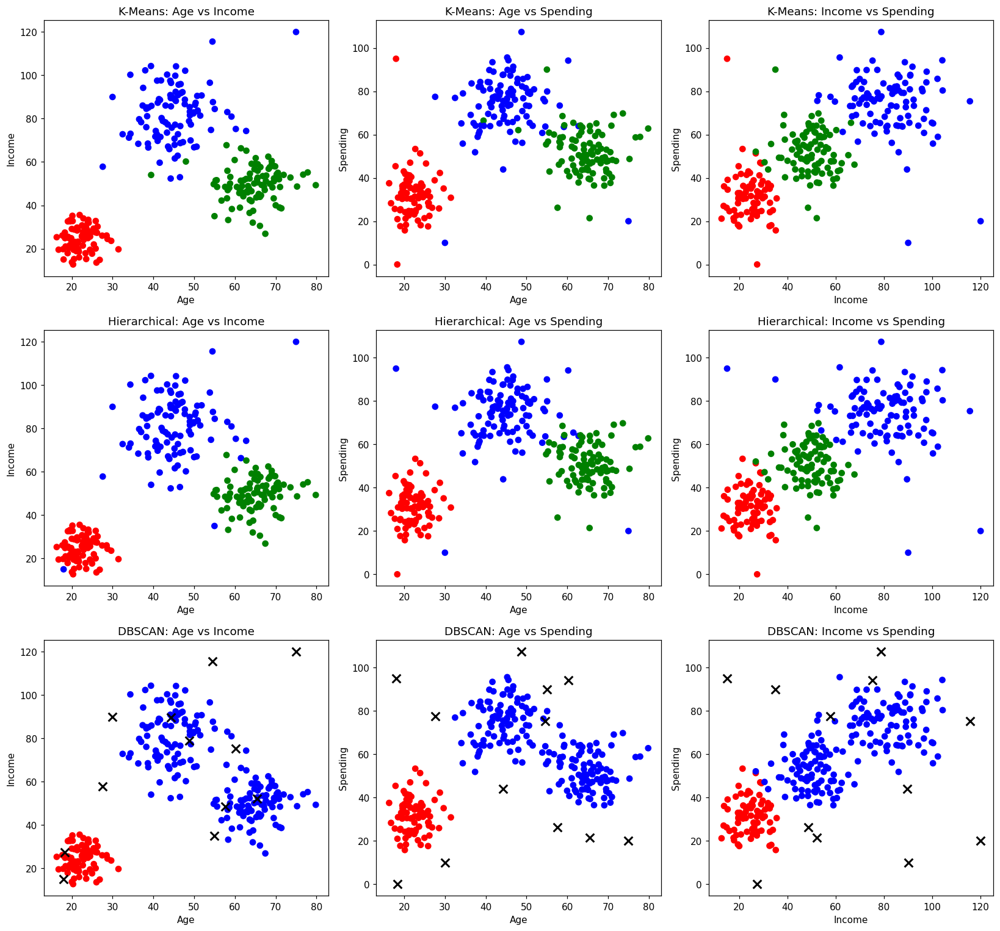

### 2.7.7 Đánh giá bằng chỉ số

**1. Silhouette Score**

Đo độ phù hợp của điểm với cụm của nó (-1 đến 1, càng cao càng tốt)

```python
valid_db = db_labels != 0     # DBSCAN: chỉ tính cho các điểm không phải noise

avg_sil_kmeans = silhouette_score(Xp, km_labels)
avg_sil_hc = silhouette_score(Xp, hc_labels)
avg_sil_dbscan = (silhouette_score(Xp[valid_db], db_labels[valid_db])
                  if len(np.unique(db_labels[valid_db])) > 1 else np.nan)

sil_table = pd.DataFrame({
    "Thuat_toan": ["K-Means", "Hierarchical", "DBSCAN"],
    "Silhouette_Score": np.round([avg_sil_kmeans, avg_sil_hc, avg_sil_dbscan], 4),
})
sil_table["Danh_gia"] = np.where(sil_table["Silhouette_Score"] > 0.5, "Tốt", "Trung bình")
sil_table
```

```text
     Thuat_toan  Silhouette_Score Danh_gia
0       K-Means            0.6021      Tốt
1  Hierarchical            0.5993      Tốt
2        DBSCAN            0.5777      Tốt
```

**Visualization Silhouette:**

```python
fig, axes = plt.subplots(3, 1, figsize=(8, 15))
plot_silhouette(Xp, km_labels, axes[0], "K-Means: ")
plot_silhouette(Xp, hc_labels, axes[1], "Hierarchical: ")
plot_silhouette(Xp[valid_db], db_labels[valid_db], axes[2], "DBSCAN (không tính noise): ")
plt.tight_layout()
plt.show()
```

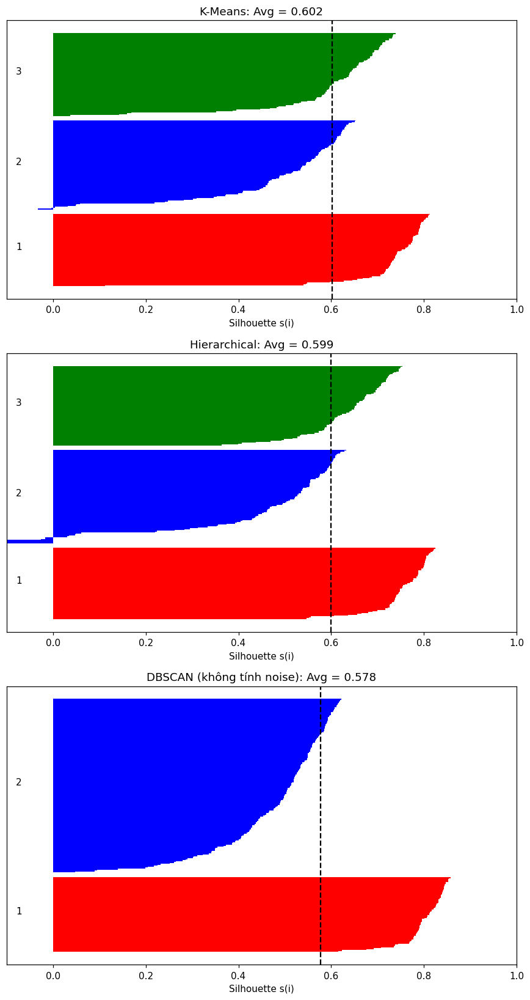

**2. WSS (Within-cluster Sum of Squares)**

Tổng khoảng cách bình phương trong cụm (càng thấp càng tốt)

```python
wss_kmeans_val = tinh_wss(Xp, km_labels)
wss_hc_val = tinh_wss(Xp, hc_labels)
wss_dbscan_val = tinh_wss(Xp, db_labels)     # Hàm tinh_wss đã bỏ qua noise (nhãn 0)

wss_all = np.array([wss_kmeans_val, wss_hc_val, wss_dbscan_val])
pd.DataFrame({
    "Thuat_toan": ["K-Means", "Hierarchical", "DBSCAN"],
    "WSS": wss_all.round(2),
    "Xep_hang": pd.Series(wss_all).rank().astype(int).values,
})
```

```text
     Thuat_toan        WSS  Xep_hang
0       K-Means   70343.74         1
1  Hierarchical   72567.96         2
2        DBSCAN  135823.06         3
```

**3. Dunn Index**

Tỷ lệ khoảng cách nhỏ nhất giữa cụm / khoảng cách lớn nhất trong cụm
(càng cao càng tốt)

```python
def calculate_dunn(X, labels):
    """Dunn = min(khoảng cách giữa các cụm) / max(đường kính trong cụm). Bỏ qua noise (nhãn 0)."""
    X = np.asarray(X)
    cums = [c for c in np.unique(labels) if c != 0]
    if len(cums) < 2:
        return np.nan
    groups = [X[labels == c] for c in cums]

    # Khoảng cách giữa cụm (inter-cluster): cặp điểm gần nhất thuộc 2 cụm khác nhau
    inter = min(cdist(groups[i], groups[j]).min()
                for i in range(len(groups)) for j in range(i + 1, len(groups)))
    # Khoảng cách trong cụm (intra-cluster): đường kính lớn nhất
    intra = max(pdist(g).max() for g in groups if len(g) > 1)
    return inter / intra

dunn_all = np.array([calculate_dunn(Xp, km_labels),
                     calculate_dunn(Xp, hc_labels),
                     calculate_dunn(Xp, db_labels)])
dunn_kmeans, dunn_hc, dunn_dbscan = dunn_all

pd.DataFrame({
    "Thuat_toan": ["K-Means", "Hierarchical", "DBSCAN"],
    "Dunn_Index": dunn_all.round(4),
    "Xep_hang": pd.Series(-dunn_all).rank().astype(int).values,
})
```

```text
     Thuat_toan  Dunn_Index  Xep_hang
0       K-Means      0.0345         3
1  Hierarchical      0.0817         2
2        DBSCAN      0.3707         1
```

**4. Kích thước cụm**

```python
pd.DataFrame({
    "KMeans": pd.Series(km_labels).value_counts().sort_index(),
    "Hierarchical": pd.Series(hc_labels).value_counts().sort_index(),
    "DBSCAN": pd.Series(db_labels[db_labels > 0]).value_counts().sort_index(),
}).rename(index=lambda k: f"Cụm {k}")
```

```text
       KMeans  Hierarchical  DBSCAN
Cụm 1      81            80    79.0
Cụm 2     100           105   183.0
Cụm 3      93            89     NaN
```

**5. Số noise (chỉ DBSCAN)**

```python
n_noise = (db_labels == 0).sum()
pd.DataFrame({
    "Metric": ["Tổng số điểm", "Số điểm noise", "Tỷ lệ noise (%)"],
    "DBSCAN": [len(Xp), n_noise, round(n_noise / len(Xp) * 100, 2)],
})
```

```text
            Metric  DBSCAN
0     Tổng số điểm  274.00
1    Số điểm noise   12.00
2  Tỷ lệ noise (%)    4.38
```

### 2.7.8 Bảng tổng hợp đánh giá

```python
def fmt(v, nd):
    return "N/A" if np.isnan(v) else round(v, nd)

comparison_table = pd.DataFrame({
    "Tieu_chi": ["Silhouette Score", "WSS", "Dunn Index",
                 "Số cụm", "Outliers", "Tốc độ", "Dễ sử dụng"],
    "KMeans": [fmt(avg_sil_kmeans, 3), fmt(wss_kmeans_val, 0), fmt(dunn_kmeans, 3),
               3, "Không phát hiện", "Nhanh", "Dễ"],
    "Hierarchical": [fmt(avg_sil_hc, 3), fmt(wss_hc_val, 0), fmt(dunn_hc, 3),
                     3, "Không phát hiện", "Chậm", "Trung bình"],
    "DBSCAN": [fmt(avg_sil_dbscan, 3), fmt(wss_dbscan_val, 0), fmt(dunn_dbscan, 3),
               db_labels.max(), f"{n_noise} điểm", "Trung bình", "Khó (chọn eps)"],
})
comparison_table
```

```text
           Tieu_chi           KMeans     Hierarchical          DBSCAN
0  Silhouette Score            0.602            0.599           0.578
1               WSS          70344.0          72568.0        135823.0
2        Dunn Index            0.034            0.082           0.371
3            Số cụm                3                3               2
4          Outliers  Không phát hiện  Không phát hiện         12 điểm
5            Tốc độ            Nhanh             Chậm      Trung bình
6        Dễ sử dụng               Dễ       Trung bình  Khó (chọn eps)
```

### 2.7.9 Phân tích từng cụm (K-Means)

```python
cluster_profiles = customers_project.groupby("KMeans_Cluster").agg(
    So_luong=("Age", "size"),
    Tuoi_TB=("Age", "mean"),
    Thu_nhap_TB=("Income", "mean"),
    Spending_TB=("Spending", "mean"),
).round(1)

cluster_profiles
```

```text
                So_luong  Tuoi_TB  Thu_nhap_TB  Spending_TB
KMeans_Cluster                                             
1                     81     22.3         24.6         31.9
2                    100     45.0         82.2         74.1
3                     93     64.5         49.8         51.7
```

**Đặc điểm và chiến lược cho từng cụm** (sinh tự động từ bảng trên – tương đương inline R code `` `r ...` `` trong bản R Markdown):

```python
chien_luoc = {
    "SINH VIÊN / TRẺ TUỔI": "Giá rẻ, khuyến mãi, marketing qua mạng xã hội",
    "TRUNG NIÊN": "Sản phẩm cao cấp (premium), chương trình VIP/loyalty, giao hàng nhanh, tư vấn chuyên sâu",
    "CAO TUỔI": "Chất lượng bền vững, dịch vụ chu đáo, chương trình khách hàng thân thiết",
}

for cum, row in cluster_profiles.iterrows():
    phan_loai = ("SINH VIÊN / TRẺ TUỔI" if row["Tuoi_TB"] < 35
                 else "TRUNG NIÊN" if row["Tuoi_TB"] < 55 else "CAO TUỔI")
    print(f"Cụm {cum}: {int(row['So_luong'])} khách hàng")
    print(f"  - Tuổi TB: {row['Tuoi_TB']} tuổi")
    print(f"  - Thu nhập TB: {row['Thu_nhap_TB']} triệu/tháng")
    print(f"  - Spending Score: {row['Spending_TB']} /100")
    print(f"  - Phân loại: Nhóm {phan_loai}")
    print(f"  - Chiến lược: {chien_luoc[phan_loai]}\n")
```

```text
Cụm 1: 81 khách hàng
  - Tuổi TB: 22.3 tuổi
  - Thu nhập TB: 24.6 triệu/tháng
  - Spending Score: 31.9 /100
  - Phân loại: Nhóm SINH VIÊN / TRẺ TUỔI
  - Chiến lược: Giá rẻ, khuyến mãi, marketing qua mạng xã hội

Cụm 2: 100 khách hàng
  - Tuổi TB: 45.0 tuổi
  - Thu nhập TB: 82.2 triệu/tháng
  - Spending Score: 74.1 /100
  - Phân loại: Nhóm TRUNG NIÊN
  - Chiến lược: Sản phẩm cao cấp (premium), chương trình VIP/loyalty, giao hàng nhanh, tư vấn chuyên sâu

Cụm 3: 93 khách hàng
  - Tuổi TB: 64.5 tuổi
  - Thu nhập TB: 49.8 triệu/tháng
  - Spending Score: 51.7 /100
  - Phân loại: Nhóm CAO TUỔI
  - Chiến lược: Chất lượng bền vững, dịch vụ chu đáo, chương trình khách hàng thân thiết
```

### 2.7.10 Khuyến nghị cuối cùng

**Đọc kết quả các chỉ số đánh giá:**

1.  **Silhouette Score**: K-Means và Hierarchical có điểm cao hơn DBSCAN → cụm tách bạch và gắn kết tốt hơn
2.  **WSS**: K-Means có WSS thấp nhất → cụm chặt chẽ nhất (điều hiển nhiên, vì K-Means *tối ưu trực tiếp* WSS). WSS của DBSCAN lớn hơn nhiều vì chỉ có 2 cụm – nhóm trung niên và cao tuổi bị gộp chung
3.  **Dunn Index**: DBSCAN cao nhất – nhưng cần đọc cẩn thận: Dunn Index rất nhạy với outliers; DBSCAN đã **loại** các điểm ngoại lai (noise) nên khoảng cách giữa các cụm còn lại lớn hơn, còn K-Means/Hierarchical phải xếp cả outliers vào cụm
4.  **Outliers**: Chỉ DBSCAN phát hiện được outliers, nhưng đổi lại gộp mất một nhóm khách hàng

**KHUYẾN NGHỊ:**

✅ **Nên chọn K-MEANS** vì:

- Silhouette Score cao nhất và WSS thấp nhất → cụm chặt chẽ, rõ ràng
- Tìm đúng 3 nhóm khách hàng có ý nghĩa kinh doanh (trẻ – trung niên – cao tuổi)
- Nhanh, dễ triển khai và dễ giải thích
- Phù hợp với dữ liệu có cấu trúc rõ ràng, cụm gần hình cầu
- Số outliers rất ít (4/274 khách hàng) nên không ảnh hưởng đáng kể

⚠️ **Hierarchical** cũng tốt nhưng:

- Chậm hơn K-Means với dữ liệu lớn
- Kết quả gần như trùng K-Means → không mang thêm thông tin

⚠️ **DBSCAN** không phù hợp làm thuật toán chính vì:

- Chỉ tìm được 2 cụm (gộp nhóm trung niên và cao tuổi)
- Silhouette thấp hơn, khó chọn tham số eps
- 👉 Tuy nhiên có thể dùng DBSCAN như **bước phụ** để phát hiện các khách hàng đặc biệt (outliers) cần chăm sóc riêng

------------------------------------------------------------------------

**KẾT LUẬN:**

Với bài toán phân khúc khách hàng này, **K-Means với K=3** là lựa chọn
tốt nhất, cho phép chia khách hàng thành 3 nhóm rõ ràng để áp dụng chiến
lược marketing phù hợp.

> **Lưu ý:** Dữ liệu được sinh ngẫu nhiên nên các con số cụ thể có thể khác nhẹ tùy phiên bản thư viện. Hãy đọc kết quả thực tế sau khi chạy code và kiểm tra lại các nhận định trên.

------------------------------------------------------------------------
